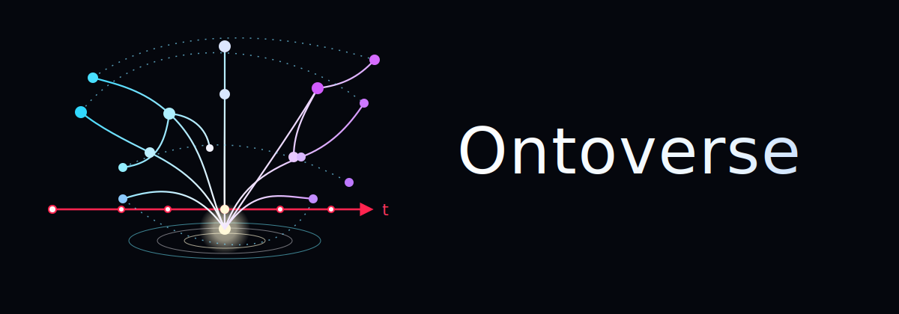

# Ontoverse

A conceptual framework for reality, time, histories, causality, and compatible worlds.

## Status

Ontoverse is a speculative conceptual framework. It is not presented as a completed physical theory.

The purpose of this repository is to organize and refine models, definitions, hypotheses, diagrams, comparisons, and open questions about how reality may be structured, how time may be interpreted, and how compatible histories may diverge, remain accessible, or locally converge.

## Documentation Map

### Framework

- [`framework/`](./docs/framework/) — high-level scope, status, core assumptions, boundaries, and open problems.

### Models

- [`models/`](./docs/models/) — conceptual models inside Ontoverse.
  - [`history-space/`](./docs/models/sub/history-space/) — reality as a structured space of possible histories.
  - [`frontal-time/`](./docs/models/sub/frontal-time/) — global frontal time, local time, temporal density, and the Planck-action hypothesis.

### Reference Material

- [`glossary/`](./docs/glossary/) — working definitions for Ontoverse terminology.
- [`notes/`](./docs/notes/) — exploratory notes and inspiration sources.

## Reuse

No license has been selected yet. Until a license is added, assume that the text, diagrams, and assets are not granted for reuse beyond normal GitHub viewing and discussion.
