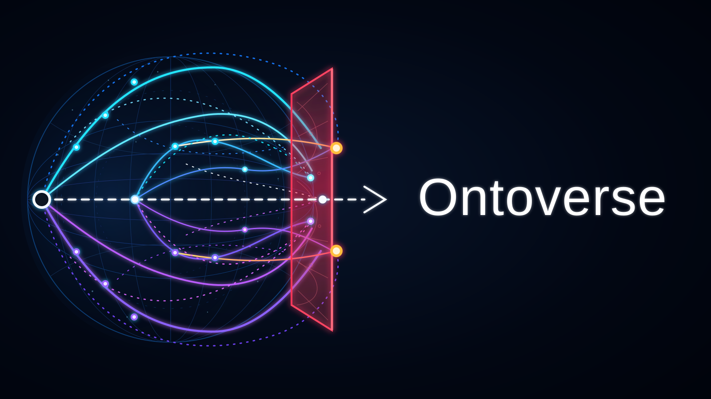

# Ontoverse



A speculative conceptual framework for exploring how histories, time, causality, observer access, and possible worlds might fit together.

## Translations

- English
- [Українська](./docs/l10n/uk_UA/)

> **Disclaimer:** Ontoverse is a collection of the author's reflections, hypotheses, conceptual models, and interpretive notes. It is not a scientific claim, proof, or established physical theory. AI tools were used to help publish, structure, translate, and refine the documentation, but the underlying ideas and conceptual direction originate from the author.

## The Question Behind Ontoverse

What if reality is neither one rigid timeline nor an infinity of fully separate timelines that must already be unfolded from the beginning?

Ontoverse explores a middle picture: a structured **history-space** in which histories that still require the same present state can remain represented together, while genuinely different states become separate **historical strands** only when a distinction is required.

All of those strands are ordered by a shared parameter called **frontal time**. An observer, however, experiences only one locally compatible route through that larger structure.

That simple picture leads to several harder questions:

- When does a possible future become a distinct history?
- Can different histories accumulate local time at different rates while sharing one global ordering?
- Can globally different histories become locally indistinguishable again?
- If information or a traveler returns from the future, where should the history actually split?
- Can a causal loop be self-consistent without treating the past as something that gets overwritten?

Ontoverse is an attempt to make those questions precise enough to inspect, criticize, compare, formalize, or reject.

## The Picture to Keep in Mind

A useful first approximation is an indefinitely multi-strand cable moving in one global direction:

```text
                         increasing frontal time F
                                  ->

history bundle    ================================>
                   \==== distinguishable strand B =>
                    \=== distinguishable strand C =>
```

But the cable is **compressed**. One visible strand can stand for many admissible complete histories while they still require the same current modeled state.

```text
one represented strand
= one current history equivalence class
= potentially many still-equivalent complete continuations
```

Only when those histories must physically differ does the representation split:

```text
shared history class
----------- first required distinction ---------->
             /                             \
        child history A               child history B
```

This is the current **Minimal Distinguishability Principle**. It is a conceptual organization rule, not a claim that the universe literally runs a compression algorithm.

## Core Ideas

- **History-Space** is the structured space of admissible complete histories.
- **History Bundle** is the currently represented set of distinguishable Historical Strands progressing in the same global frontal-time direction.
- **History Equivalence Classes** keep still-indistinguishable histories represented together instead of expanding every possible future into a separate line from the beginning.
- **Divergence** occurs at the first required physical, record, or causal distinction between previously equivalent histories.
- **Frontal Time** is a proposed global ordering parameter. Each value `F` defines a global history-bundle slice `S(F)`; the current maximum `F_max` is the latest actualized slice in the shown model state.
- **Local Time** is associated with significant transitions accumulated along one compatible Historical Strand, while **Temporal Density** describes how frequently those transitions occur over a shared frontal-time interval.
- **Causal Processing Density** is a separate speculative concept for local state-coordination or processing load; it should not be confused with Temporal Density.
- **Compatibility and Convergence** describe how observers can access only locally compatible states and how globally different histories may become locally equivalent without erasing their different pasts.
- **Global Consistency Constraints** require represented states to belong to at least one self-consistent complete continuation while still allowing several incompatible histories.
- **Closed Time Loops** explore past-directed travel as a globally constrained causal structure: the returned traveler may force an earlier history-class split, while the later departure closes the loop rather than creating a branch at departure.
- **Future-Derived Information** appears when memories or records from a later state are carried into an earlier state of the same loop-compatible history. Such apparent foreknowledge is history-relative, not unrestricted knowledge of every future.

## A Closed Loop in One Glance

The time-travel case shows why the history-bundle model matters.

```text
shared history class
-------------------R-------------------->
                    |\
                    | \  loop-free strand
                    |
                    +---- loop-compatible strand ---- D
                          ^                             |
                          +------ past transit ---------+
```

`R` is the earlier reintegration event. In the minimal case, that is where the loop-compatible history first differs physically from the loop-free one, so the history class splits there.

`D` is the later departure. It does not create the branch; it closes the already self-consistent loop.

This means the model does not need a story in which the universe first completes one past and then rewrites it. The returned traveler, the traveler's memories, the downstream consequences, and the later departure must all fit inside one admissible complete causal structure.

## Suggested Reading Route

If this is your first visit, the shortest path through the framework is:

1. [`framework/`](./docs/sub/framework/) — the whole model in one place.
2. [`history-space/`](./docs/sub/models/sub/history-space/) — the history bundle, equivalence classes, divergence, convergence, and observer access.
3. [`frontal-time/`](./docs/sub/models/sub/frontal-time/) — global slices, local time, temporal density, and speculative links to gravity.
4. [`closed-time-loop/`](./docs/sub/models/sub/closed-time-loop/) — the most demanding consistency test of the current framework.
5. [`visualizations/`](./docs/sub/visualizations/) — diagrams for the main structures.
6. [`glossary/`](./docs/sub/glossary/) — canonical working definitions when a term needs to be checked precisely.

Other useful entry points:

- [`event-density-dark-sector/`](./docs/sub/models/sub/event-density-dark-sector/) — a deliberately speculative dark-matter-like/gravity conjecture built on causal processing density;
- [`public-positioning/`](./docs/sub/public-positioning/) — how Ontoverse should and should not be presented publicly;
- [`for-researchers-and-communicators/`](./docs/sub/for-researchers-and-communicators/) — a critical-review entry point;
- [`review-checklist/`](./docs/sub/review-checklist/) — checks for overstatement and conceptual slippage;
- [`notes/`](./docs/sub/notes/) — exploratory material and inspiration sources;
- [`branding/`](./docs/sub/branding/) — Ontoverse visual identity.

## Name Origin

**Ontoverse** combines **ontology** — the study of what exists and how reality may be structured — with **-verse**, a suffix suggesting a universe, multiverse, or conceptual space of possible worlds.

## Status and Boundaries

Ontoverse is speculative. It does not currently claim to replace quantum mechanics or relativity, prove many-worlds, demonstrate physical time travel, establish a new law of physics, or provide experimentally verified predictions.

Its history-bundle, equivalence-class, frontal-time, density, gravity, and causal-loop components remain open to mathematical comparison, criticism, formalization, revision, and rejection.

The project is useful only to the extent that its structure makes those operations easier.

## Authorship and AI Assistance

The conceptual ideas presented in Ontoverse — including its hypotheses, models, terminology proposals, and interpretive directions — originate from the author.

AI tools were used for editorial and organizational assistance such as terminology refinement, document structure, wording improvement, translation, language polishing, and drafting repository documentation.

## Reuse

No license has been selected yet. Until a license is added, assume that the text, diagrams, and assets are not granted for reuse beyond normal GitHub viewing and discussion.
