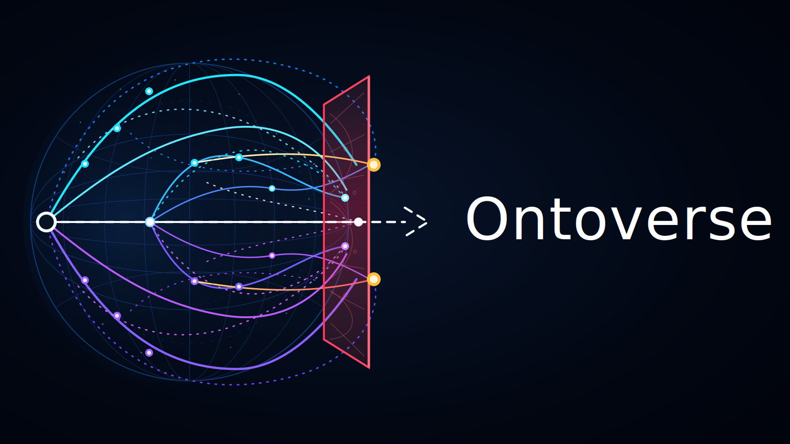

# Branding

<!--
ai_content:
  managed: true
  l10n: true
-->

Status: draft

Ontoverse branding uses the author-approved dark neon conceptual physics style.

## Translations

- English — current
- [Українська](./l10n/uk_UA/)

## Primary Logo

The primary logo is the dark neon Ontoverse wordmark with a history-space emblem and a rectangular ruby frontal time plane.



Asset path:

```text
assets/default/images/ontoverse-logo-frontal-plane-rectangular.svg
```

## Asset Rule

Do not replace the approved visual direction with simplified SVG approximations unless the author explicitly approves that exact replacement.

Detailed SVG assets are preferred for repository documentation because they are source-controlled, reviewable, and editable. A raster export may be added later for contexts where PNG or WebP rendering looks better.

If a raster export is added, keep the SVG as the editable source unless the author explicitly marks the raster image as the visual source of truth.
