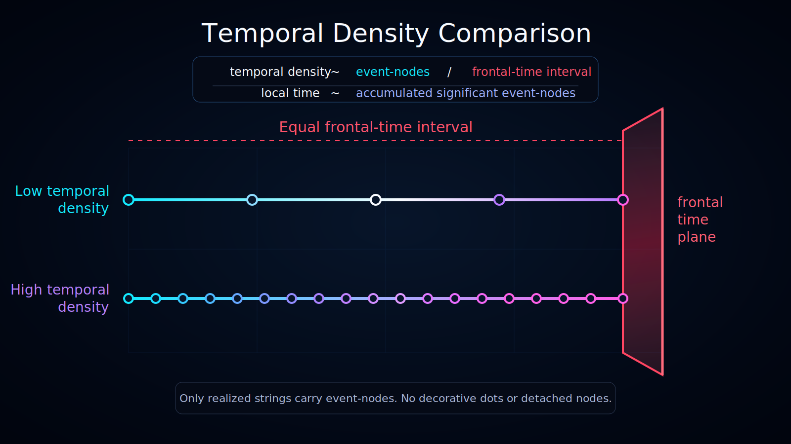
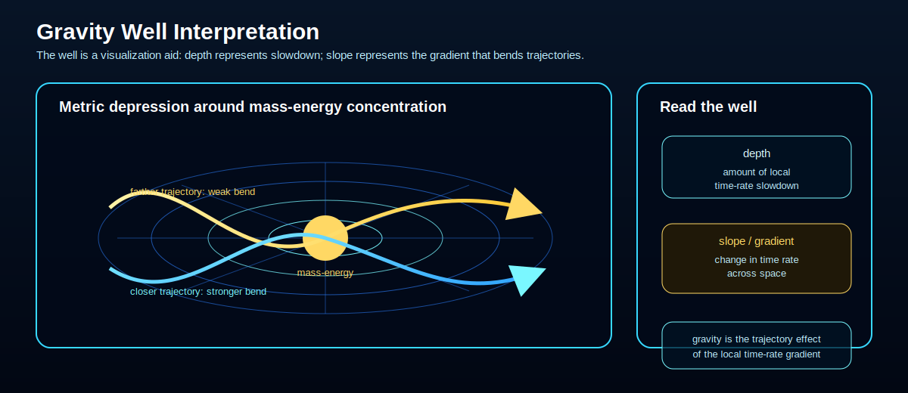
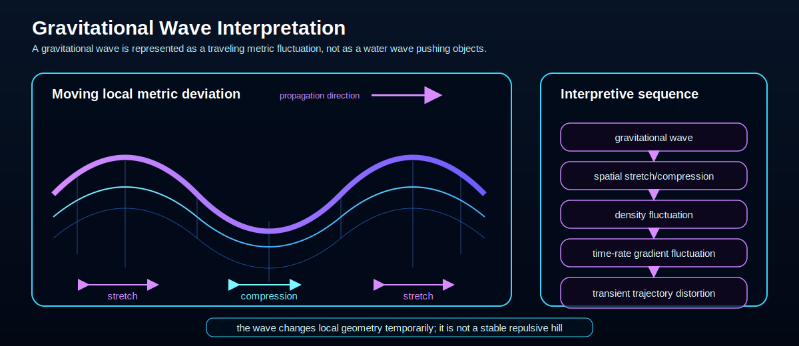

# Frontal Time Model

Status: draft

The Frontal Time Model introduces a distinction between a global ordering parameter and locally experienced time.



## Frontal Time

Frontal time is a proposed global ordering parameter for the unfolding of history-space.

It may be visualized as a wavefront or plane moving through the space of possible histories. The image is metaphorical: frontal time is not yet defined as a physical field, metric, or measurable quantity.

In Ontoverse diagrams, the frontal time plane is represented as a ruby boundary. It should normally be treated as the present boundary of the described model slice.

This means that realized event-nodes and trajectories should stop at the frontal time plane unless the document explicitly defines a future-side region as hypothetical or inaccessible.

In the Ontoverse logo, the frontal time axis is represented by the ruby line.

## Local Time

Local time is the time experienced along a particular historical trajectory.

The working intuition is that experienced time corresponds not merely to an external coordinate, but to the accumulation of significant physical transitions along a trajectory.

In informal terms:

```text
local time ~ accumulated significant event-nodes
```

## Temporal Density

Temporal density is the proposed number of significant event-nodes per unit of frontal time.

A trajectory with more significant transitions over the same frontal-time interval has higher temporal density.

```text
temporal density ~ event-nodes / frontal-time interval
```

This is a conceptual expression, not a defined physical equation.

Temporal density may be uneven across history-space. Some regions or trajectories may be sparse, others dense, and others mixed or clustered.

See also:

- [`temporal-density-comparison`](../../../visualizations/sub/temporal-density-comparison/);
- [`history-space-density-regions`](../../../visualizations/sub/history-space-density-regions/);
- [`uneven-temporal-density`](../../../visualizations/sub/uneven-temporal-density/).

## Quantum Transition Rate Conjecture

Status: conjecture

The quantum transition rate conjecture refines the earlier Planck-action wording.

The established physics background is that Planck's constant has the dimensions of action, and since the 2019 SI revision its numerical value is fixed exactly as:

```text
h = 6.62607015 x 10^-34 J s
```

Planck's constant, or the reduced Planck constant `hbar`, is not treated here as a direct measure of temporal density. It is better understood as part of the quantum scale that relates action, energy, frequency, phase, and quantum-state evolution.

The Ontoverse conjecture is different:

```text
The density of significant event-nodes along a branch may depend on an effective quantum transition rate relative to frontal time.
```

In this model, the primary candidate quantity is not `h` by itself, but an effective transition-rate parameter:

```text
Gamma_eff = effective rate of significant quantum transitions per unit of frontal time
```

This parameter is conceptual. It is not currently a measured physical constant or a defined equation.

A possible physical inspiration is that quantum-state evolution is controlled by the relation between the system's effective Hamiltonian scale and `hbar`:

```text
quantum-state evolution rate ~ H_eff / hbar_eff
```

For transition-like event-nodes, the effective rate may also depend on interaction strength, coupling between states, density of available final states, decoherence-related processes, and other branch-specific physical structure.

In Ontoverse terms:

```text
frontal time = shared ordering front
Gamma_eff = effective significant-transition rate
Gamma_eff -> event-node density
event-node density -> local time accumulation
```

Under this conjecture, if two branches share the same frontal-time interval but differ in their effective quantum transition rate, they may accumulate different numbers of significant event-nodes.

A branch with higher `Gamma_eff` would contain more significant event-nodes per frontal-time interval and therefore higher temporal density. A branch with lower `Gamma_eff` would contain fewer significant event-nodes per frontal-time interval and therefore lower temporal density.

This gives a conceptual route for interpreting why local time may appear to progress faster in one branch and slower in another, while frontal time remains the shared ordering parameter.

## Branch Metrics and Local Metric Deviations

Status: working definition

The model may distinguish between an absolute baseline metric, a branch baseline metric, and local metric deviations.

### Related Visualizations

The visual explanation is split into smaller SVG diagrams so each image has one primary concept:






The absolute baseline metric is a shared conceptual zero-point. It represents an abstract reference state with no mass, no gravitational distortion, and no meaningful causal processing density. It is not treated as a living timeline state, because without mass, energy, or state changes, there are no events to actualize.

The branch baseline metric represents the average nominal state of a specific timeline branch. It includes the branch's average mass-energy distribution, average gravitational background, average causal processing density, and default branch time rate.

In this sense, the branch baseline metric defines the temporal character of a branch:

```text
branch baseline metric
-> average causal processing density
-> branch time rate
-> default temporal density of the branch
```

Local gravitational effects are then modeled as deviations from the branch baseline metric, not from absolute zero. A planet, star, black hole, dense matter region, low-density region, or gravitational wave may be interpreted as a local metric deviation within the branch.

## Causal Processing Density and Gravity

Status: interpretive hypothesis

Causal processing density is a proposed Ontoverse term for the amount of local state change, interaction, and causal coordination that must be maintained in a region relative to the frontal-time ordering.

In established general relativity, gravity is described through spacetime geometry shaped by mass and energy, not as an ordinary pulling force. The common gravity-well image is therefore only a simplified visualization. The "well" does not represent a literal surface; it represents a change in spacetime geometry and local time rate.

Within Ontoverse, mass-energy concentration may be interpreted as a physical marker of concentrated local states. The more mass and energy exist in a region, the more local states, interactions, and causal relations must be maintained near the time front. This increases the region's causal processing density.

Higher causal processing density is interpreted as lowering the local time rate relative to less dense regions. Gravity is not identified with this slowdown alone. Gravity appears where the local time rate changes across space.

```text
mass-energy concentration
-> causal processing density increase
-> local time-rate slowdown
-> local time-rate gradient
-> curved possible trajectories
-> gravitational effect
```

In this interpretation, the depth of a gravity-well visualization represents the amount of local time-rate slowdown, while the slope of the well represents the gradient that changes trajectories. Objects do not fall because space is literally pulled downward; they follow paths shaped by uneven local time rates and causal processing density.

Gravitational waves can be described as traveling fluctuations of this structure. They are not permanent hills that push objects like water waves push a surfboard. Instead, they temporarily stretch and compress spatial relations, creating oscillating changes in causal processing density and local time-rate gradients.

```text
gravitational wave
-> moving local metric deviation
-> spatial stretch/compression
-> causal processing density fluctuation
-> local time-rate gradient fluctuation
-> transient trajectory distortion
```

This remains an interpretive model component, not a derived physical theory.

## Relation to the Quantum of Action

The physical concept of a quantum of action is established physics. The speculative Ontoverse component is the proposed relation between quantum transition rates, event-node density, and local-time accumulation.

The conjecture should therefore not be stated as:

```text
Planck's constant directly defines temporal density.
```

A more precise formulation is:

```text
Effective quantum-transition dynamics, possibly involving H_eff / hbar_eff and related dimensionless physical relations, may influence event-node density relative to frontal time.
```

This distinction matters because raw changes to a dimensionful constant such as `h` are not necessarily physically meaningful by themselves. A stronger future version of the conjecture should identify dimensionless relations that control effective quantum transition rates.

## Light-Path Analogy

The light-path analogy is an interpretive analogy inspired by explanations of how light can be modeled as exploring many possible paths while the observed contribution behaves as if a particular path or phase-coherent family of paths dominates.

In Ontoverse terms, this analogy suggests a possible way to think about an experienced history:

```text
A lived or observed trajectory may be treated as one compatible path through a wider history-space of potential paths.
```

This is only an analogy. It does not claim that human-scale histories literally behave like light rays, nor that Ontoverse currently derives from optics or path-integral physics.

The analogy is useful because it separates:

- the wider space of possible trajectories;
- the compatible or dominant path that becomes relevant to observation;
- the need to define why one accessible history is experienced rather than another.

## Interpretive Claim

The tentative claim is not:

```text
Planck's constant proves the Ontoverse model.
```

The tentative claim is:

```text
Effective quantum-transition dynamics may be a useful candidate for formalizing temporal density because quantum mechanics already relates state evolution, transition rates, energy scales, and the quantum of action.
```

## Open Problems

- Define what qualifies as a significant event-node.
- Determine whether temporal density can be expressed through an effective transition rate, action, entropy, decoherence rate, information change, or another quantity.
- Clarify whether `event-nodes / frontal-time` can become a rigorous measure.
- Determine whether `Gamma_eff` can be formalized through Hamiltonian evolution, transition rates, decoherence, interaction rates, or only used as a conceptual placeholder.
- Clarify whether Planck's constant is only background motivation here or whether dimensionless relations involving `hbar` can serve as part of a formal scale relation.
- Clarify how this model relates to proper time in relativity.
- Clarify how branch baseline metrics, local metric deviations, and causal processing density could be compared with spacetime curvature, gravitational time dilation, and stress-energy in established relativity.
- Clarify whether gravitational-wave analogies should be limited to metric fluctuation metaphors or can be mapped to more formal wave-like changes in causal processing density.
- Clarify whether the light-path analogy can be mapped to action principles, path integrals, or only used as a conceptual metaphor.
