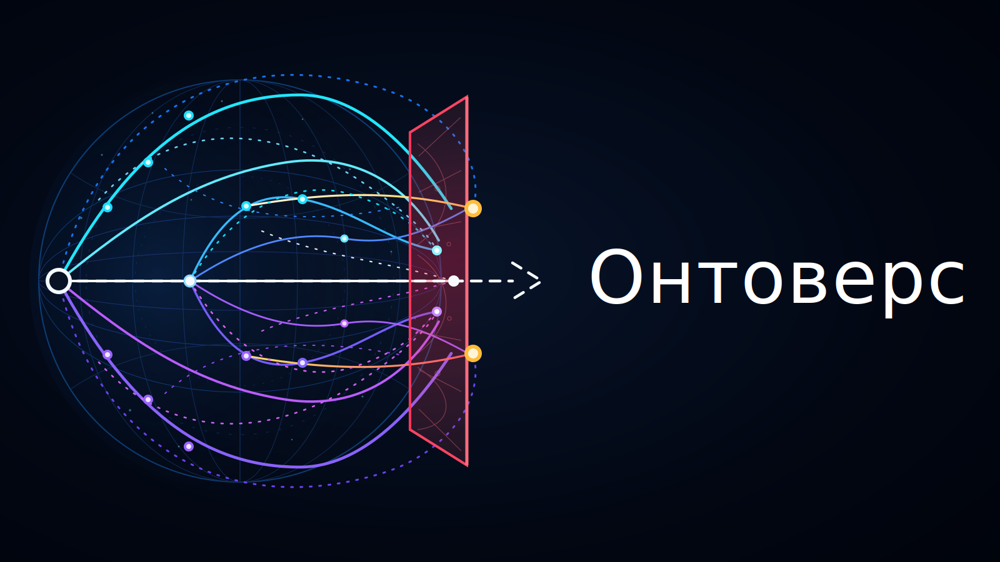

<!--
l10n:
  locale: uk_UA
  source_locale: default
  source_path: ../../README.md
  source_hash: sha256:861050452b64524cb78af97af5824c8433c721a2ed9468e7d26befed3e4a7c91
  mode: translated
-->

# Брендинг

Статус: draft

Брендинг Ontoverse використовує затверджений автором темний неоновий стиль концептуальної фізики.

## Переклади

- [English](../../)
- Українська

## Основний логотип

Основний логотип — темний неоновий словесний знак Ontoverse з емблемою history-space та прямокутною рубіновою площиною фронтального часу.



Шлях до asset:

```text
docs/assets/uk_UA/images/ontoverse-logo-frontal-plane-rectangular.svg
```

## Правило asset

Не замінюйте затверджений візуальний напрям спрощеними SVG approximation, якщо автор явно не затвердив саме таку заміну.

Деталізовані SVG-ресурси бажані для документації репозиторію, бо вони зберігаються під керуванням версій і придатні до перевірки та редагування. Растровий експорт можна додати пізніше для контекстів, де відтворення PNG або WebP виглядає краще.

Якщо raster export буде додано, зберігайте SVG як editable source, якщо автор явно не позначить raster image як visual source of truth.
