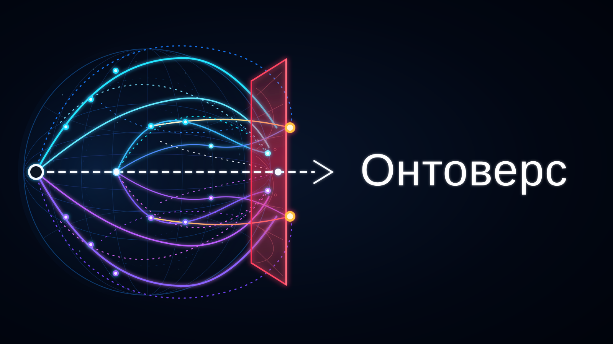

# Брендинг

Статус: чернетка

Брендинг Ontoverse використовує затверджений автором темний неоновий стиль концептуальної фізики.

## Переклади

- [English](../../)
- Українська

## Основний логотип

Основний логотип — темний неоновий словесний знак Ontoverse з емблемою простору історій і прямокутною рубіновою площиною фронтального часу.



Шлях до ресурсу:

```text
docs/assets/uk_UA/images/ontoverse-logo-frontal-plane-rectangular.svg
```

## Правило для ресурсів

Не замінюйте затверджений візуальний напрям спрощеними SVG-наближеннями, якщо автор явно не схвалив саме таку заміну.

Деталізовані SVG бажані для документації репозиторію, оскільки вони версіонуються, перевіряються та редагуються. Растровий експорт можна додати пізніше для контекстів, де PNG або WebP відтворюються краще.

Якщо додається растровий експорт, SVG слід зберегти як редаговане джерело, якщо автор явно не позначив растр як візуальне джерело істини.
