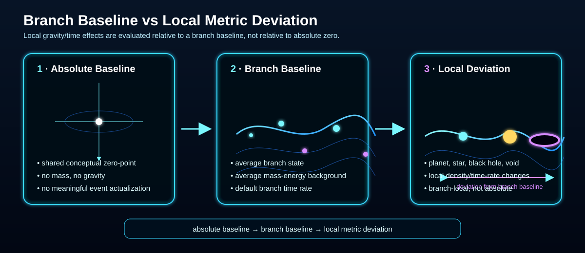
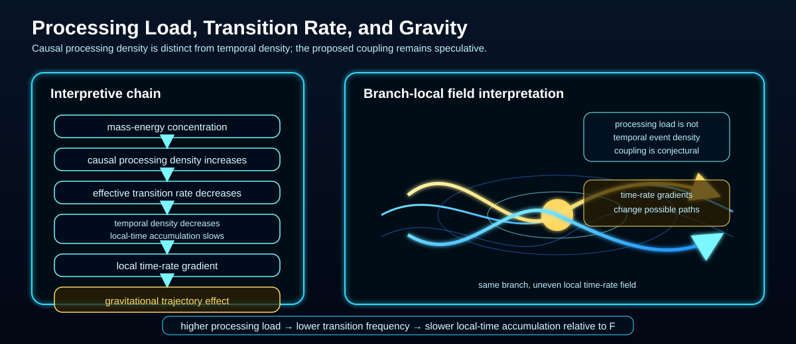
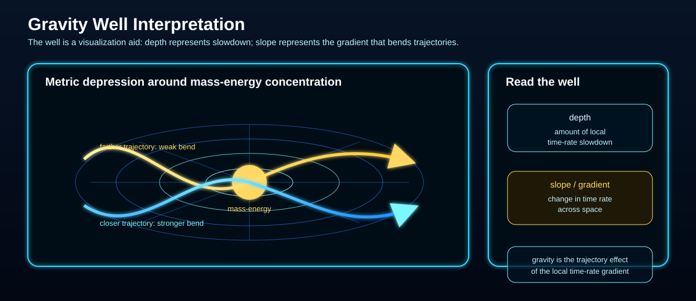
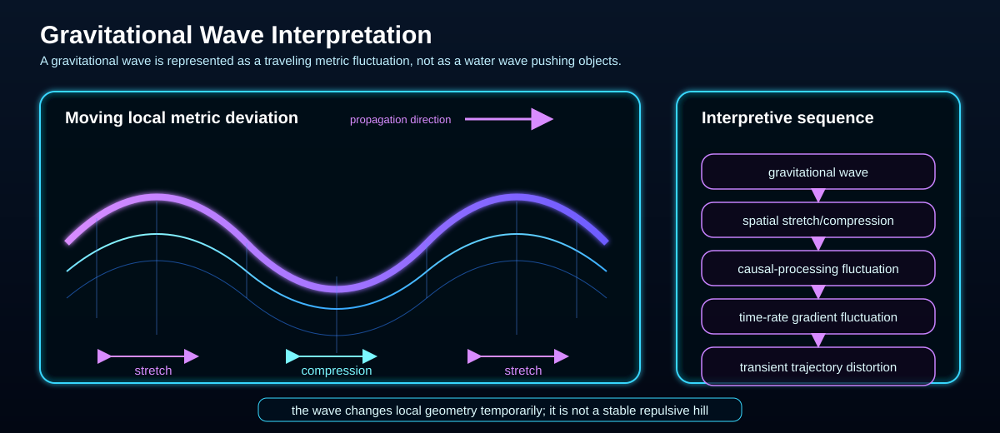

# Frontal Time Model

Status: draft

The Frontal Time Model starts from a tension:

> If many histories can exist or remain admissible at once, what does it mean for all of them to be “at the same time”?

Ontoverse answers with a proposed global ordering parameter `F` called **Frontal Time**.

It is not ordinary experienced time. It is the common ordering against which the current History Bundle is sampled.


## Frontal Time

A value of `F` defines a global cross-section of the current History Bundle:

```text
frontal-time value F
-> global slice S(F)
-> current states of all distinguishable history classes at F
```

Ontoverse calls this a **Frontal-Time Slice**.

The phrase **all at once** means all currently distinguishable history-class states at one shared global ordering value. It does not mean that one observer experiences all histories or all frontal-time values simultaneously.

## Why a Slice Matters

A slice lets the framework separate two questions that are usually collapsed into one:

```text
What is the global ordering state of history-space?
```

and

```text
How much local change has one particular Historical Strand accumulated?
```

Those need not be the same thing.

Two strands can both reach the same `S(F)` while having passed through very different numbers of significant local transitions.

## The Current Slice Is Compressed

`S(F)` does not need one separately drawn state for every complete future continuation.

Instead:

```text
S(F)
= states of currently distinguishable history classes
+ still-compressed admissible continuations inside those classes
```

A class may contain many complete histories as long as those histories still require the same current state.

This is a conceptual compression rule, not a claim that the universe literally executes a storage algorithm.

## Unfolding of Time

The current Ontoverse picture of global time is a progression of slices:

```text
S(F0) -> S(F1) -> S(F2) -> S(F3) -> ...
```

The notation is sampled and does not imply that Frontal Time is fundamentally discrete.

At a later slice, each represented history class may:

- remain one class if its admissible continuations still require the same state;
- split when different current states become necessary;
- remain globally distinct while sharing a local Compatibility Channel with other strands.

This makes the unfolding of time a progression of **state distinctions**, not a brute-force enumeration of every possible complete timeline.

## Minimal Distinguishability Principle

The current working rule is:

> Preserve histories in one represented class while their current modeled states are equivalent; separate them only when a physical, record, or causal distinction must already exist.

See [`history-space`](../history-space/) for the detailed History Equivalence Class model.

## Why Local Forward Chaining Is Not Enough

A rule like

```text
previous node -> next node
```

works for simple forward stories, but it becomes inadequate when the causal structure contains a loop.

For that reason, Ontoverse treats Frontal-Time actualization as a global consistency problem:

```text
current slice S(F)
+ current represented history classes
+ admissible continuation space
+ global consistency constraints
-> next consistent bundle state
```

A current state is admissible only if it belongs to at least one globally self-consistent complete continuation.

Several incompatible complete continuations may still satisfy that condition. Global consistency therefore does **not** imply one deterministic future.

## Branching Under Frontal Time

A Divergence Node is not best understood as the moment when all future worlds suddenly appear.

It is the earliest Frontal-Time location where one represented history class can no longer remain one class.

```text
one history class
-> alternatives remain state-equivalent
-> no explicit split yet

later consistency requirement
-> different current states required
-> Divergence Node
-> separate child strands
```

A future causal condition can therefore imply that the distinction must already exist at an earlier slice.

Past-directed travel is the clearest example.

## The Time-Travel Stress Test

Suppose one admissible continuation contains a Closed Time Loop and another does not.

If the loop reintegrates a traveler at `R`, then at `R` the loop-compatible continuation already contains a different state:

```text
before R:
loop-compatible and loop-free continuations may share one class

at R:
loop-compatible state = traveler + memories + records + consequences
loop-free state       = no returned traveler

therefore:
class split occurs at R
```

The future departure `D` does not rewrite `R` later.

Instead, the complete loop is one global consistency condition:

```text
R -> ordinary history -> D -> isolated past transit -> R
```

If some physical difference is required even earlier than apparent reintegration, the class must split at that earlier first distinction.

## Distant Past-Directed Travel

A large distance between `R` and `D` does not create a special logical problem for Frontal Time.

```text
early R
-> long local history
-> invention
-> departure D
-> isolated past transit
-> same R
```

The loop-compatible history simply becomes distinct wherever the returned state first requires it.

This is a consistency statement, not evidence that arbitrarily distant physical time travel is possible. Geometry, energy, stability, information, and other physical limits remain open.

## Future-Derived Information

The same structure can carry information rather than only matter.

```text
later record
-> past-directed carrier
-> earlier memory or record
-> earlier reaction
-> same self-consistent later record
```

To an earlier observer this can resemble prediction or a “vision” of the future.

Within Ontoverse, however, the information comes from a later state of **one compatible history**, not from unrestricted inspection of every possible future.

Bootstrap-information loops remain an unresolved problem.

## Current Frontier and Reference Slices

The current maximum `F_max` is the greatest frontal-time value treated as actualized in the shown model state.

When a diagram shows `S(F_max)`, the ruby Frontal Time Plane is the **current frontier**:

```text
represented History Bundle -> S(F_max)
```

Realized strands normally terminate there.

A retrospective diagram may instead show an earlier reference slice `S(F_ref)` inside already described history. Realized structure can then appear on both sides because the plane is not the current maximum.

This is the mode used by the Closed Time Loop visualization.

## Observer Access

A global slice can contain many mutually incompatible history-class states.

A local observer does not experience that whole slice.

```text
global S(F)
= many history-class states

observer experience
= one compatible path through successive slices
```

Frontal Time is therefore global while observer experience remains local.

## Local Time

Local Time is the time experienced along one Historical Strand.

The current intuition is that Local Time accumulates through significant physical transitions as Frontal Time advances globally.

```text
local time ~ accumulated significant Event-Nodes
```

That gives Ontoverse a way to discuss different local time rates without giving each strand a different global ordering direction.

## Temporal Density

Temporal Density is the proposed frequency of significant Event-Nodes per frontal-time interval.

```text
sampled slices:       F0  F1  F2  F3  F4  F5  F6
high-density strand:  *   *   *   *   *   *   *
low-density strand:   *   .   .   *   .   .   *
```

Both strands advance through the same Frontal-Time ordering. They differ only in how frequently significant local transitions accumulate.

```text
Temporal Density ~ significant Event-Nodes / frontal-time interval
```

Under the current hypothesis, higher Temporal Density means more local-time accumulation over the same `ΔF`.

A History Equivalence Class that later splits may share one represented density profile before divergence and develop separate profiles afterward.

## Temporal Density Is Not Processing Load

**Temporal Density** and **Causal Processing Density** are different concepts.

Temporal Density:

```text
frequency of significant strand-local transitions / ΔF
```

Causal Processing Density:

```text
speculative amount of local state coordination,
constraint, interaction bookkeeping,
or physical processing load relative to Frontal-Time slices
```

The current gravity interpretation explores the conjectural chain:

```text
higher causal processing load
-> lower effective significant-transition rate
-> lower Temporal Density
-> slower local-time accumulation relative to F
```

This is not established physics.

## Quantum Transition Rate Conjecture

Status: conjecture

The model uses a placeholder:

```text
Gamma_eff = effective rate of significant quantum transitions per unit of Frontal Time
```

The established physics background is that Planck's constant has the dimensions of action and, since the 2019 SI revision, has the exact value:

```text
h = 6.62607015 x 10^-34 J s
```

Ontoverse does **not** treat `h` or `hbar` as direct Temporal Density measures.

The speculative bridge is instead:

```text
quantum-state dynamics
-> Gamma_eff
-> significant Event-Node frequency
-> Temporal Density
-> Local Time accumulation
```

A possible physical inspiration is the role of effective Hamiltonian scales relative to `hbar`, together with interaction strength, available states, coupling, decoherence, and other physical structure.

No rigorous mapping has yet been defined.

## Branch Metrics and Local Metric Deviations

Status: working definition

The model may distinguish between an absolute baseline metric, a Historical Strand baseline metric, and local metric deviations.

### Related Visualizations









A strand baseline represents the average nominal state of one currently distinguishable Historical Strand. Before a class split, descendants may share one represented baseline; afterward, child strands may develop distinct baselines.

```text
Historical Strand baseline
-> average Causal Processing Density
-> effective transition rate
-> Temporal Density
-> strand-local time rate
```

## Causal Processing Density and Gravity

Status: interpretive hypothesis

Within Ontoverse, mass-energy concentration may be treated as a marker of increased local state-coordination load.

The current conjectural chain is:

```text
mass-energy concentration
-> Causal Processing Density increases
-> effective significant-transition rate decreases
-> Temporal Density decreases
-> Local Time rate slows relative to F
-> local time-rate gradient
-> curved possible trajectories
-> gravitational effect
```

The middle steps are speculative Ontoverse components, not established physics.

Gravitational waves are analogously represented as moving metric deviations that may temporarily alter causal-processing load and local time-rate gradients.

## Relation to Existing Concepts

The Frontal-Time and History-Bundle model should be compared with existing ideas including:

- global time parameters and foliations;
- branching-time semantics;
- equivalence classes and quotient-state representations;
- consistent and decoherent histories;
- coarse-graining;
- state-space dynamics;
- global boundary-condition and all-at-once formulations;
- retrocausal descriptions;
- closed timelike curves and self-consistency conditions.

No equivalence is currently claimed.

## Open Problems

- Define mathematically what a Frontal-Time Slice `S(F)` contains.
- Define the current maximum `F_max` rigorously.
- Determine whether Frontal Time is continuous, discrete, or only an ordering relation.
- Define the History Equivalence relation used to compress admissible continuations.
- Formalize how one slice and its continuation space produce the next represented History Bundle.
- Formalize the first-required-distinction rule for class splitting.
- Clarify whether histories only refine/split under Frontal-Time progression or whether global recompression has physical meaning.
- Clarify whether global consistency preserves many admissible histories, introduces probabilities, or requires another selection rule.
- Relate Frontal-Time slices to established physical notions of time and causality without assuming equivalence.
- Define what qualifies as a significant Event-Node.
- Formalize Temporal Density and its behavior before and after history-class splits.
- Determine whether `Gamma_eff` can be linked to established transition-rate physics.
- Formalize the distinction and possible coupling between Causal Processing Density and Temporal Density.
- Clarify how Local Time relates to proper time in relativity.
- Formalize strand baseline metrics and local metric deviations.
- Compare time-loop-induced class splitting with established treatments of closed timelike curves, retrocausality, and global consistency.
