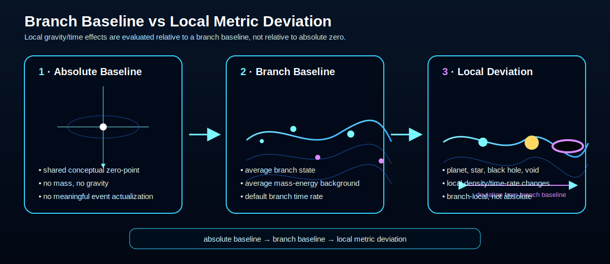
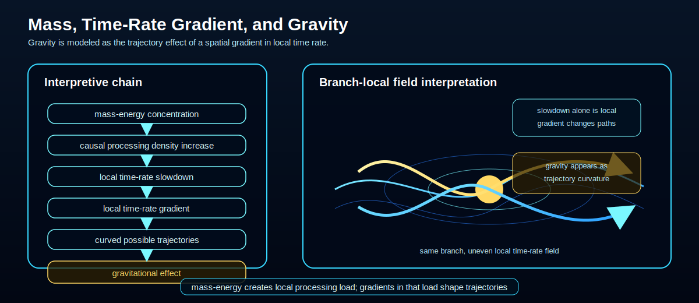

<!--
l10n:
  locale: uk_UA
  source_locale: default
  source_path: ../../README.md
  source_hash: sha256:9e29a07ac7c299e843111b5d8be8551b1743dd9daeb38a8115e2b6c74f2af55b
  mode: translated
-->

# Модель фронтального часу

Статус: draft

Модель фронтального часу вводить відмінність між глобальним параметром упорядкування та локально пережитим часом.


## Переклади

- [English](../../)
- Українська

## Фронтальний час

Фронтальний час — запропонований глобальний параметр упорядкування розгортання history-space.

Його можна уявляти як хвильовий фронт або площину, що рухається крізь простір можливих історій. Цей образ метафоричний: фронтальний час ще не визначено як фізичне поле, метрику чи вимірювану величину.

На діаграмах Ontoverse площина фронтального часу представлена як рубінова межа. Зазвичай її слід трактувати як межу теперішнього описаного зрізу моделі.

Це означає, що реалізовані вузли подій і траєкторії повинні зупинятися на площині фронтального часу, якщо документ явно не визначає область із боку майбутнього як гіпотетичну або недоступну.

У логотипі Ontoverse вісь фронтального часу представлена рубіновою лінією.

## Локальний час

Локальний час — час, пережитий уздовж певної історичної траєкторії.

Робоча інтуїція полягає в тому, що пережитий час відповідає не лише зовнішній координаті, а накопиченню значущих фізичних переходів уздовж траєкторії.

```text
локальний час ~ накопичені значущі вузли подій
```

## Темпоральна щільність

Темпоральна щільність — запропонована кількість значущих вузлів подій на одиницю фронтального часу.

Траєкторія з більшою кількістю значущих переходів за той самий інтервал фронтального часу має вищу темпоральну щільність.

```text
темпоральна щільність ~ вузли подій / інтервал фронтального часу
```

Це концептуальний вираз, а не визначене фізичне рівняння.

Темпоральна щільність може бути нерівномірною в history-space. Одні регіони або траєкторії можуть бути розрідженими, інші щільними, змішаними чи кластеризованими.

Див. також:

- [`temporal-density-comparison`](../../../../../visualizations/sub/temporal-density-comparison/l10n/uk_UA/);
- [`history-space-density-regions`](../../../../../visualizations/sub/history-space-density-regions/l10n/uk_UA/);
- [`uneven-temporal-density`](../../../../../visualizations/sub/uneven-temporal-density/l10n/uk_UA/).

## Гіпотеза швидкості квантових переходів

Статус: conjecture

Гіпотеза швидкості квантових переходів уточнює попереднє формулювання через дію Планка.

Усталене фізичне підґрунтя полягає в тому, що стала Планка має розмірність дії, а після перегляду SI 2019 року її числове значення зафіксовано точно:

```text
h = 6.62607015 x 10^-34 J s
```

Стала Планка або зведена стала Планка `hbar` тут не вважається прямою мірою темпоральної щільності. Її краще розуміти як частину квантового масштабу, що пов’язує дію, енергію, частоту, фазу та еволюцію квантового стану.

Гіпотеза Ontoverse інша:

```text
Щільність значущих вузлів подій уздовж гілки може залежати від ефективної швидкості квантових переходів відносно фронтального часу.
```

Основною величиною-кандидатом є не сама `h`, а параметр ефективної швидкості переходів:

```text
Gamma_eff = ефективна швидкість значущих квантових переходів на одиницю фронтального часу
```

Цей параметр концептуальний. Наразі він не є виміряною фізичною сталою чи визначеним рівнянням.

Можливе фізичне натхнення полягає в тому, що еволюція квантового стану контролюється співвідношенням ефективного гамільтонового масштабу системи та `hbar`:

```text
швидкість еволюції квантового стану ~ H_eff / hbar_eff
```

Для перехідних вузлів подій ефективна швидкість також може залежати від сили взаємодії, зв’язку між станами, щільності доступних кінцевих станів, процесів декогеренції та іншої специфічної для гілки фізичної структури.

У термінах Ontoverse:

```text
фронтальний час = спільний фронт упорядкування
Gamma_eff = ефективна швидкість значущих переходів
Gamma_eff -> щільність вузлів подій
щільність вузлів подій -> накопичення локального часу
```

Якщо дві гілки мають той самий інтервал фронтального часу, але різні ефективні швидкості квантових переходів, вони можуть накопичити різну кількість значущих вузлів подій.

Гілка з вищою `Gamma_eff` містила б більше значущих вузлів подій на інтервал фронтального часу й мала б вищу темпоральну щільність. Гілка з нижчою `Gamma_eff` містила б менше вузлів і мала б нижчу щільність.

Це дає концептуальний шлях для інтерпретації того, чому локальний час може здаватися швидшим в одній гілці й повільнішим в іншій, тоді як фронтальний час лишається спільним параметром упорядкування.

## Метрики гілки та локальні відхилення метрики

Статус: working definition

Модель може розрізняти абсолютну базову метрику, базову метрику гілки та локальні відхилення метрики.

### Пов’язані візуалізації

Візуальне пояснення поділено на менші SVG-діаграми, щоб кожне зображення мало одну основну концепцію:






Абсолютна базова метрика — спільна концептуальна нульова точка. Вона представляє абстрактний еталонний стан без маси, гравітаційного викривлення та значущої щільності причинної обробки. Вона не вважається станом живої часової лінії, бо без маси, енергії або змін стану немає подій для актуалізації.

Базова метрика гілки представляє середній номінальний стан певної гілки часової лінії. Вона охоплює середній розподіл маси-енергії, середнє гравітаційне тло, середню щільність причинної обробки та стандартну швидкість часу гілки.

У цьому сенсі базова метрика визначає темпоральний характер гілки:

```text
базова метрика гілки
-> середня щільність причинної обробки
-> швидкість часу гілки
-> стандартна темпоральна щільність гілки
```

Локальні гравітаційні ефекти тоді моделюються як відхилення від базової метрики гілки, а не від абсолютного нуля. Планета, зоря, чорна діра, щільний регіон матерії, регіон низької щільності або гравітаційна хвиля можуть інтерпретуватися як локальне відхилення метрики всередині гілки.

## Щільність причинної обробки та гравітація

Статус: interpretive hypothesis

Щільність причинної обробки — запропонований термін Ontoverse для кількості локальних змін стану, взаємодій і причинної координації, які потрібно підтримувати в регіоні відносно впорядкування фронтального часу.

В усталеній загальній теорії відносності гравітація описується геометрією простору-часу, сформованою масою та енергією, а не звичайною силою тяжіння. Поширене зображення гравітаційної ями є лише спрощеною візуалізацією. «Яма» не є буквальною поверхнею; вона представляє зміну геометрії простору-часу та швидкості локального часу.

В Ontoverse концентрацію маси-енергії можна інтерпретувати як фізичний маркер концентрованих локальних станів. Що більше маси й енергії є в регіоні, то більше локальних станів, взаємодій і причинних зв’язків потрібно підтримувати біля фронту часу. Це підвищує щільність причинної обробки регіону.

Вища щільність причинної обробки інтерпретується як така, що знижує швидкість локального часу. Гравітація не ототожнюється лише з цим уповільненням. Вона виникає там, де швидкість локального часу змінюється у просторі.

```text
концентрація маси-енергії
-> зростання щільності причинної обробки
-> уповільнення локального часу
-> градієнт швидкості локального часу
-> викривлені можливі траєкторії
-> гравітаційний ефект
```

Глибина візуалізації гравітаційної ями представляє величину уповільнення локального часу, а її нахил — градієнт, що змінює траєкторії. Об’єкти падають не тому, що простір буквально тягнеться вниз; вони рухаються шляхами, сформованими нерівномірними швидкостями локального часу та щільністю причинної обробки.

Гравітаційні хвилі можна описати як рухомі флуктуації цієї структури. Це не постійні пагорби, що штовхають об’єкти як водяні хвилі дошку. Натомість вони тимчасово розтягують і стискають просторові відношення, створюючи осциляційні зміни щільності причинної обробки та градієнтів швидкості локального часу.

```text
гравітаційна хвиля
-> рухоме локальне відхилення метрики
-> просторове розтягнення/стиснення
-> флуктуація щільності причинної обробки
-> флуктуація градієнта швидкості локального часу
-> тимчасове викривлення траєкторій
```

Це лишається інтерпретаційним компонентом моделі, а не виведеною фізичною теорією.

## Зв’язок із квантом дії

Фізична концепція кванта дії є усталеною фізикою. Спекулятивним компонентом Ontoverse є запропонований зв’язок між швидкостями квантових переходів, щільністю вузлів подій і накопиченням локального часу.

Тому гіпотезу не слід формулювати так:

```text
Стала Планка безпосередньо визначає темпоральну щільність.
```

Точніше формулювання:

```text
Ефективна динаміка квантових переходів, можливо із залученням H_eff / hbar_eff та пов’язаних безрозмірних фізичних співвідношень, може впливати на щільність вузлів подій відносно фронтального часу.
```

Ця відмінність важлива, бо самі по собі зміни розмірної сталої на кшталт `h` не обов’язково фізично значущі. Сильніша майбутня версія гіпотези має визначити безрозмірні співвідношення, що контролюють ефективні швидкості квантових переходів.

## Аналогія зі шляхом світла

Це інтерпретаційна аналогія, натхненна поясненнями, де світло моделюється як таке, що досліджує багато можливих шляхів, тоді як спостережуваний внесок поводиться так, наче домінує певний шлях або фазово когерентне сімейство шляхів.

У термінах Ontoverse аналогія пропонує спосіб міркувати про пережиту історію:

```text
Пережиту або спостережувану траєкторію можна розглядати як один сумісний шлях крізь ширший history-space потенційних шляхів.
```

Це лише аналогія. Вона не стверджує, що історії людського масштабу буквально поводяться як промені світла або що Ontoverse уже виводиться з оптики чи фізики інтеграла за траєкторіями.

Аналогія корисна, бо розділяє:

- ширший простір можливих траєкторій;
- сумісний або домінантний шлях, релевантний спостереженню;
- потребу визначити, чому переживається одна доступна історія, а не інша.

## Інтерпретаційне твердження

Попереднє твердження — не:

```text
Стала Планка доводить модель Ontoverse.
```

Попереднє твердження:

```text
Ефективна динаміка квантових переходів може бути корисним кандидатом для формалізації темпоральної щільності, оскільки квантова механіка вже пов’язує еволюцію стану, швидкості переходів, енергетичні масштаби та квант дії.
```

## Відкриті проблеми

- Визначити, що кваліфікується як значущий вузол події.
- Визначити, чи темпоральну щільність можна виразити через ефективну швидкість переходів, дію, ентропію, швидкість декогеренції, зміну інформації або іншу величину.
- Уточнити, чи `вузли подій / фронтальний час` може стати строгою мірою.
- Визначити, чи `Gamma_eff` можна формалізувати через гамільтонову еволюцію, швидкості переходів, декогеренцію, швидкості взаємодій або лише як концептуальний placeholder.
- Уточнити, чи стала Планка є лише фоновою мотивацією, або безрозмірні співвідношення з `hbar` можуть бути частиною формального масштабного співвідношення.
- Уточнити зв’язок моделі з власним часом у теорії відносності.
- Уточнити порівняння базових метрик гілок, локальних відхилень метрики та щільності причинної обробки з кривиною простору-часу, гравітаційним сповільненням часу й тензором енергії-імпульсу в усталеній теорії відносності.
- Уточнити, чи аналогії з гравітаційними хвилями мають обмежуватися метафорами флуктуацій метрики, чи їх можна зіставити з формальнішими хвилеподібними змінами щільності причинної обробки.
- Уточнити, чи аналогію зі шляхом світла можна зіставити з принципами дії та інтегралами за траєкторіями, чи використовувати лише як концептуальну метафору.
