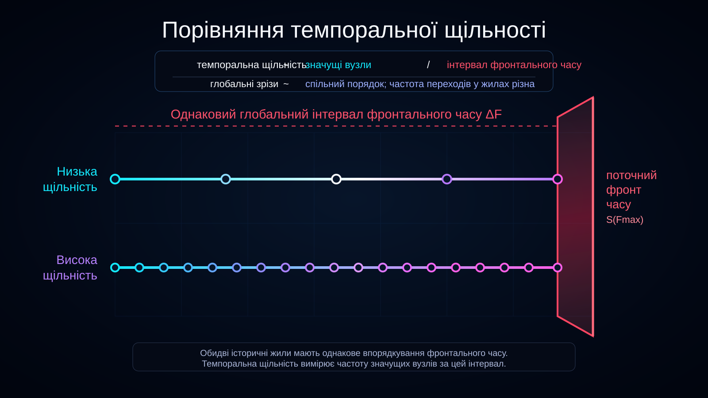
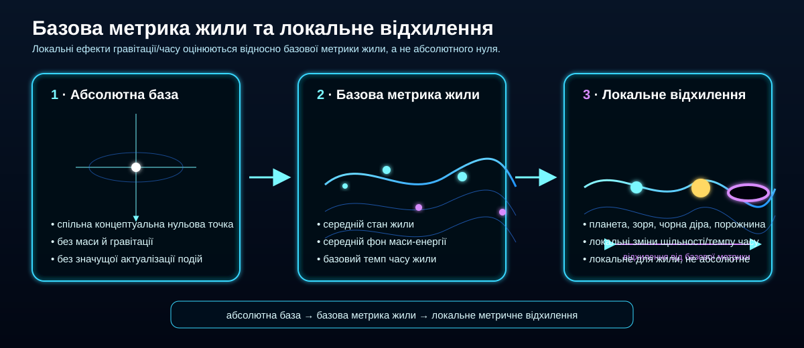
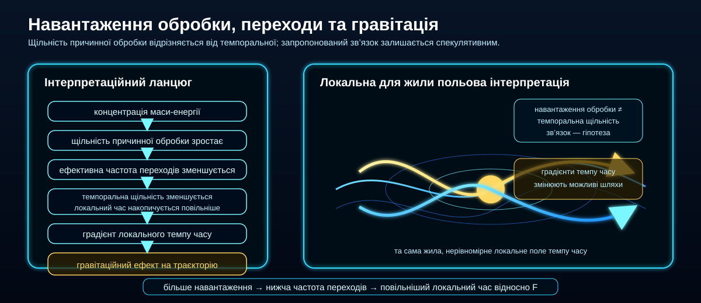
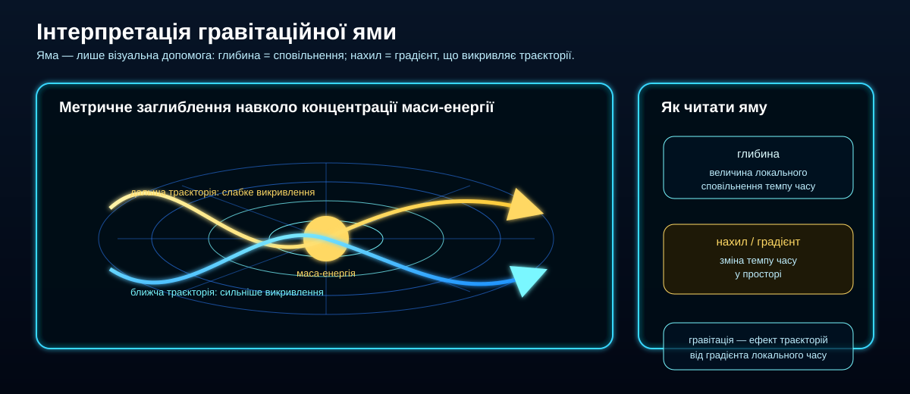
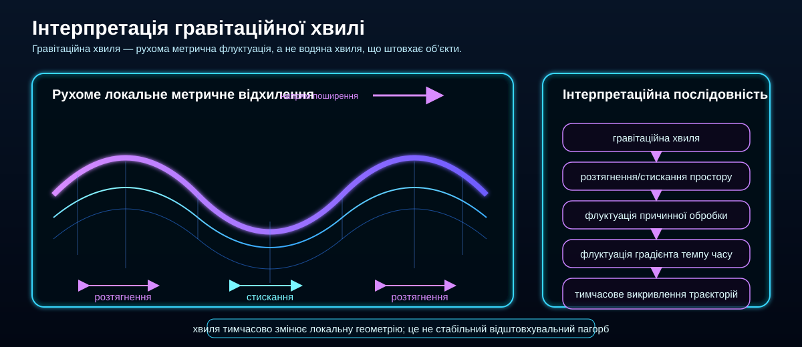

# Модель фронтального часу

Статус: чернетка

Модель фронтального часу починається з напруження між двома рівнями опису:

> Якщо багато історій можуть існувати або залишатися допустимими одночасно, що означає для них усіх бути «в один і той самий час»?

Ontoverse відповідає запропонованим глобальним параметром упорядкування `F`, який називається **фронтальним часом (Frontal Time)**.

Це не звичайний пережитий час. Це спільне впорядкування, відносно якого розглядається поточний пучок історій.



## Переклади

- [English](../../)
- Українська

## Фронтальний час

Значення `F` задає глобальний поперечний зріз поточного пучка історій:

```text
значення фронтального часу F
-> глобальний зріз S(F)
-> поточні стани всіх розрізнюваних класів історій при F
```

Ontoverse називає це **зрізом фронтального часу (Frontal-Time Slice)**.

Фраза **«усе одночасно»** означає всі поточно розрізнювані стани класів історій при одному спільному значенні глобального впорядкування. Вона не означає, що один спостерігач переживає всі історії або всі значення фронтального часу одночасно.

## Навіщо потрібен зріз

Зріз дозволяє розвести два питання, які часто зливають в одне:

```text
Який глобальний стан упорядкування простору історій?
```

і

```text
Скільки локальних змін накопичила конкретна історична жила?
```

Ці величини не зобов’язані збігатися.

Дві жили можуть досягти того самого `S(F)`, пройшовши через дуже різну кількість значущих локальних переходів.

## Поточний зріз є стисненим

`S(F)` не потребує окремо намальованого стану для кожного повного майбутнього продовження.

Натомість:

```text
S(F)
= стани поточно розрізнюваних класів історій
+ ще стиснені допустимі продовження всередині цих класів
```

Клас може містити багато повних історій, доки вони все ще потребують однакового поточного стану.

Це концептуальне правило стиснення, а не твердження, що Всесвіт буквально виконує алгоритм зберігання даних.

## Розгортання часу

Поточна картина глобального часу в Ontoverse — це послідовність зрізів:

```text
S(F0) -> S(F1) -> S(F2) -> S(F3) -> ...
```

Позначення є вибірковим і не означає, що фронтальний час фундаментально дискретний.

На пізнішому зрізі кожен представлений клас історій може:

- залишитися одним класом, якщо допустимі продовження все ще потребують того самого стану;
- розділитися, коли стають необхідними різні поточні стани;
- залишатися глобально окремим, але мати спільний локальний канал сумісності з іншими жилами.

Тому розгортання часу можна читати як прогресію **відмінностей стану**, а не як повний перебір усіх можливих завершених часових ліній.

## Принцип мінімальної розрізнюваності

Поточне робоче правило:

> Зберігати історії в одному представленому класі, доки їхні поточні модельовані стани еквівалентні; розділяти їх лише тоді, коли фізична, записана або причинна відмінність уже повинна існувати.

Детальну модель класів еквівалентності див. у [`history-space`](../../../history-space/l10n/uk_UA/).

## Чому локального руху вперед недостатньо

Правило на кшталт

```text
попередній вузол -> наступний вузол
```

працює для простих причинних історій, спрямованих уперед, але стає недостатнім, коли причинна структура містить петлю.

Тому Ontoverse трактує актуалізацію фронтального часу як глобальну задачу самоузгодженості:

```text
поточний зріз S(F)
+ поточно представлені класи історій
+ простір допустимих продовжень
+ обмеження глобальної самоузгодженості
-> наступний узгоджений стан пучка
```

Поточний стан допустимий лише тоді, коли він належить принаймні одному глобально самоузгодженому повному продовженню.

Кілька несумісних повних продовжень можуть одночасно виконувати цю умову. Тому глобальна самоузгодженість **не** означає єдиного детермінованого майбутнього.

## Розгалуження під фронтальним часом

Вузол розгалуження не варто розуміти як мить, коли раптом виникають усі майбутні світи.

Це найраніше значення фронтального часу, де один представлений клас історій більше не може залишатися одним класом.

```text
один клас історій
-> альтернативи ще еквівалентні за станом
-> явного розділення ще немає

пізніша вимога самоузгодженості
-> потрібні різні поточні стани
-> вузол розгалуження
-> окремі дочірні жили
```

Майбутня причинна умова може означати, що відмінність уже повинна існувати на ранішому зрізі.

Найвиразніший приклад — подорож у минуле.

## Стрес-тест подорожжю в часі

Припустімо, одне допустиме продовження містить замкнену часову петлю, а інше — ні.

Якщо петля повертає мандрівника в `R`, то в `R` сумісне з петлею продовження вже має інший стан:

```text
до R:
продовження з петлею й без петлі можуть мати один клас

у R:
стан з петлею = мандрівник + пам’ять + записи + наслідки
стан без петлі = поверненого мандрівника немає

отже:
клас розділяється в R
```

Майбутнє відправлення `D` не переписує `R` пізніше.

Повна петля є однією глобальною умовою самоузгодженості:

```text
R -> звичайна історія -> D -> ізольований транзит у минуле -> R
```

Якщо фізична відмінність потрібна ще раніше за видиму реінтеграцію, клас повинен розділитися в тій ранішій першій точці.

## Далека подорож у минуле

Велика відстань між `R` і `D` не створює окремої логічної проблеми для фронтального часу.

```text
раннє R
-> довга локальна історія
-> винайдення
-> відправлення D
-> ізольований транзит у минуле
-> те саме R
```

Історія з петлею просто стає розрізнюваною там, де повернений стан уперше цього потребує.

Це твердження про самоузгодженість, а не доказ фізичної можливості довільно далекої подорожі в минуле. Геометричні, енергетичні, інформаційні та інші фізичні межі залишаються відкритими.

## Інформація з майбутнього

Та сама структура може переносити інформацію, а не лише матерію.

```text
пізніший запис
-> носій, спрямований у минуле
-> раніша пам’ять або запис
-> раніша реакція
-> той самий самоузгоджений пізніший запис
```

Для раннього спостерігача це може виглядати як прогноз або «бачення» майбутнього.

У межах Ontoverse інформація приходить із пізнішого стану **однієї сумісної історії**, а не з необмежженого перегляду всіх можливих майбутніх станів.

Петлі бутстреп-інформації залишаються нерозв’язаною проблемою.

## Поточний фронт і опорні зрізи

Поточне максимальне `F_max` — найбільше значення фронтального часу, яке в показаному стані моделі вважається актуалізованим.

Коли діаграма показує `S(F_max)`, рубінова площина фронтального часу є **поточним фронтом**:

```text
представлений пучок історій -> S(F_max)
```

Реалізовані жили зазвичай закінчуються на ньому.

Ретроспективна діаграма може натомість показати раніший опорний зріз `S(F_ref)` усередині вже описаної історії. Тоді реалізована структура може бути показана з обох боків площини, бо це не поточний максимум.

Саме цей режим використовується у візуалізації замкненої часової петлі.

## Доступ спостерігача

Глобальний зріз може містити багато взаємно несумісних станів класів історій.

Локальний спостерігач не переживає весь зріз.

```text
глобальний S(F)
= багато станів класів історій

досвід спостерігача
= один сумісний шлях через послідовні зрізи
```

Фронтальний час глобальний, а досвід спостерігача залишається локальним.

## Локальний час

**Локальний час (Local Time)** — час, який накопичується вздовж однієї історичної жили.

Поточна інтуїція полягає в тому, що локальний час накопичується через значущі фізичні переходи, поки фронтальний час глобально просувається вперед.

```text
локальний час ~ накопичені значущі вузли подій
```

Так Ontoverse може обговорювати різні локальні темпи часу, не надаючи кожній жилі окремого глобального напрямку часу.

## Темпоральна щільність

**Темпоральна щільність (Temporal Density)** — запропонована частота значущих вузлів подій на інтервал фронтального часу.

```text
вибрані зрізи:          F0  F1  F2  F3  F4  F5  F6
жила високої щільності: *   *   *   *   *   *   *
жила низької щільності: *   .   .   *   .   .   *
```

Обидві жили рухаються в одному глобальному порядку фронтального часу. Вони відрізняються лише частотою накопичення значущих локальних переходів.

```text
темпоральна щільність ~ значущі вузли подій / інтервал фронтального часу
```

За поточною гіпотезою вища темпоральна щільність означає більше накопичення локального часу за той самий `ΔF`.

Клас еквівалентності історій, який пізніше розділяється, може мати один спільний представлений профіль щільності до розгалуження й окремі профілі після нього.

## Темпоральна щільність — не навантаження обробки

**Темпоральна щільність** і **щільність причинної обробки** — різні поняття.

Темпоральна щільність:

```text
частота значущих переходів у жилі / ΔF
```

Щільність причинної обробки:

```text
спекулятивний обсяг локального узгодження станів,
обмежень, взаємодій або фізичного навантаження
відносно зрізів фронтального часу
```

Поточна гравітаційна інтерпретація досліджує гіпотетичний ланцюг:

```text
вище навантаження причинної обробки
-> нижча ефективна частота значущих переходів
-> нижча темпоральна щільність
-> повільніше накопичення локального часу відносно F
```

Це не усталена фізика.

## Гіпотеза ефективної швидкості квантових переходів

Статус: гіпотеза

Модель використовує робочий параметр:

```text
Gamma_eff = ефективна частота значущих квантових переходів на одиницю фронтального часу
```

Усталений фізичний фон: стала Планка має розмірність дії, а після перегляду SI 2019 року її точне числове значення становить:

```text
h = 6.62607015 x 10^-34 J s
```

Ontoverse **не** трактує `h` або `hbar` як прямі міри темпоральної щільності.

Спекулятивний місток натомість такий:

```text
динаміка квантового стану
-> Gamma_eff
-> частота значущих вузлів подій
-> темпоральна щільність
-> накопичення локального часу
```

Можливим фізичним натхненням є роль ефективного масштабу гамільтоніана відносно `hbar`, а також сили взаємодії, доступних станів, зв’язку, декогеренції та іншої фізичної структури.

Строгого відображення поки немає.

## Базова метрика жили та локальні відхилення

Статус: робоче визначення

Модель може розрізняти абсолютну базову метрику, базову метрику історичної жили та локальні метричні відхилення.

### Пов’язані візуалізації









Базова метрика жили представляє середній номінальний стан однієї поточно розрізнюваної історичної жили. До розділення класу майбутні дочірні продовження можуть мати одну спільну базову метрику; після розділення дочірні жили можуть розвивати різні базові метрики.

```text
базова метрика історичної жили
-> середня щільність причинної обробки
-> ефективна частота переходів
-> темпоральна щільність
-> локальний темп часу жили
```

## Щільність причинної обробки та гравітація

Статус: інтерпретаційна гіпотеза

У межах Ontoverse концентрацію маси-енергії можна трактувати як можливий маркер збільшеного локального навантаження на узгодження станів.

Поточний спекулятивний ланцюг:

```text
концентрація маси-енергії
-> щільність причинної обробки зростає
-> ефективна частота значущих переходів зменшується
-> темпоральна щільність зменшується
-> локальний час сповільнюється відносно F
-> градієнт локального темпу часу
-> викривлення можливих траєкторій
-> гравітаційний ефект
```

Середні кроки тут є спекулятивними компонентами Ontoverse, а не усталеною фізикою.

Гравітаційні хвилі аналогічно представляються як рухомі метричні відхилення, які гіпотетично можуть тимчасово змінювати навантаження причинної обробки та градієнти локального темпу часу.

## Зв’язок з наявними концепціями

Модель фронтального часу та пучка історій слід порівнювати, зокрема, з такими ідеями:

- глобальні параметри часу та фоліації;
- семантика розгалуженого часу;
- класи еквівалентності та quotient-state представлення;
- узгоджені й декогерентні історії;
- coarse-graining;
- динаміка просторів станів;
- глобальні граничні умови та all-at-once формулювання;
- ретрокаузальні описи;
- замкнені часоподібні криві та умови самоузгодженості.

Еквівалентність цим підходам не заявляється.

## Відкриті проблеми

- Математично визначити, що саме містить зріз фронтального часу `S(F)`.
- Строго визначити поточне максимальне `F_max`.
- Визначити, чи фронтальний час безперервний, дискретний або є лише відношенням порядку.
- Визначити відношення еквівалентності історій, яке використовується для стиснення допустимих продовжень.
- Формалізувати, як один зріз і простір його продовжень породжують наступний представлений пучок історій.
- Формалізувати правило першої необхідної відмінності для розділення класів.
- З’ясувати, чи історії лише уточнюються/розділяються зі зростанням фронтального часу, чи глобальне повторне стиснення має фізичний зміст.
- З’ясувати, чи глобальна самоузгодженість зберігає багато допустимих історій, вводить імовірності або потребує додаткового правила вибору.
- Порівняти зрізи фронтального часу з усталеними фізичними поняттями часу та причинності без припущення про еквівалентність.
- Визначити, що саме є значущим вузлом події.
- Формалізувати темпоральну щільність і її поведінку до та після розділення класів історій.
- Визначити, чи можна пов’язати `Gamma_eff` з усталеною фізикою швидкостей переходів.
- Формалізувати розрізнення й можливий зв’язок між щільністю причинної обробки та темпоральною щільністю.
- Уточнити зв’язок локального часу з власним часом у теорії відносності.
- Формалізувати базові метрики жил і локальні метричні відхилення.
- Порівняти розділення класів, спричинене часовою петлею, з усталеними підходами до замкнених часоподібних кривих, ретрокаузальності та глобальної самоузгодженості.
