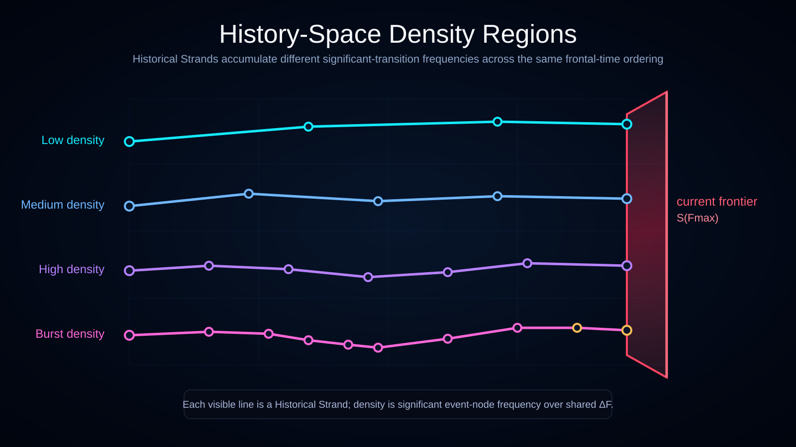

# History-Space Model

Status: draft

The History-Space Model describes reality as a structured space of possible histories.

A history is not treated as a single absolute timeline. It is treated as a trajectory through a space of compatible states, records, and interactions.



## Core Intuition

Reality can be imagined as a space containing many historical trajectories.

These trajectories are similar to threads or strings. They may branch apart when incompatible continuations become possible, and they may later enter shared future channels when their locally accessible states become equivalent under a chosen description.

The key point is that history-space is not expected to be uniformly dense. Some regions may contain sparse event-node patterns, while others may contain dense or clustered event-node structures.

This is a visual and conceptual model, not yet a mathematical theory.

## Global Frontal-Time Slices

History-space is ordered globally by frontal time.

At a frontal-time value `F`, Ontoverse represents the current cross-section of history-space as a **frontal-time slice** `S(F)`.

Conceptually:

```text
S(F)
= branch-local states across history-space
  evaluated at the same global frontal-time value F
```

A single slice may therefore contain states from many mutually incompatible histories at once. This does not mean that one local observer experiences those histories simultaneously. Observer access remains branch-local.

Successive slices provide the current Ontoverse picture of history-space unfolding:

```text
S(F0) -> S(F1) -> S(F2) -> ...
```

The notation is conceptual and does not yet require frontal time to be fundamentally discrete.

## Elements

### Historical Trajectory

A historical trajectory is a path through history-space.

It represents a sequence of mutually compatible states, records, and interactions across successive frontal-time slices.

### Event-Node

An event-node is a significant transition point in a historical trajectory.

A node may represent a quantum, causal, informational, or observational transition, depending on the level of description.

A branch need not produce a significant event-node at every frontal-time slice. Its state may persist or change below the threshold represented by an event-node.

A rigorous definition of significance is still open.

### Divergence Node

A divergence node is a point where one trajectory separates into multiple incompatible continuations.

In a quantum-inspired interpretation, this may be compared to a branching of decoherent alternatives, but Ontoverse does not yet define the Hilbert-space mapping required to make this precise.

A Closed Time Loop departure is **not** a divergence node merely because the traveler leaves ordinary forward historical synchronization. A closed loop remains part of one self-consistent historical trajectory unless an independent incompatibility creates ordinary branching.

### Compatibility Channel

A compatibility channel is a shared access structure where only mutually compatible states, records, and observers can interact.

### Convergent Channel

A convergent channel is a compatibility channel entered by more than one historical trajectory.

This does not mean that distinct histories become globally identical. It means that, for a specified observer, subsystem, or coarse-grained description, their locally accessible future states may be equivalent.

See [`convergent-channel`](../../../visualizations/sub/convergent-channel/) for the current visual explanation.

## Admissible Continuations and Global Consistency

The current Ontoverse interpretation does not require a frontal-time slice to be generated only from the immediately preceding local event-node.

A branch state is instead treated as admissible only if it can belong to at least one globally self-consistent continuation of the relevant history-space structure.

Conceptually:

```text
current branch state at S(F)
+ compatible causal structure
+ admissible continuations
+ global consistency constraints
-> one or more viable continuations
```

If several incompatible continuations remain viable, they may correspond to different history-space branches.

This rule therefore constrains branching without eliminating it. It also gives the Closed Time Loop model a way to contain an earlier reintegration and a later departure inside one complete self-consistent history without treating the time-travel event itself as a branch generator.

## Frontal-Time Boundary and Reference Slices

The current maximum frontal-time value `F_max` represents the latest actualized global slice in the model.

When a diagram shows `S(F_max)`, the ruby frontal-time plane is a **current frontier**. Realized trajectories normally terminate at that plane.

A retrospective diagram may instead show an earlier selected slice `S(F_ref)` inside a larger already-described causal structure. In that case, realized history can appear on both sides of the plane because the plane is a reference slice rather than the current maximal frontier.

The owning visualization must make this distinction explicit.

## Important Distinction

A convergent channel is not a claim that information about different pasts is destroyed.

The safer interpretation is:

```text
Globally: histories may remain distinct.
Locally: their accessible future states may become equivalent.
```

This distinction is necessary because standard quantum mechanics is normally formulated with unitary evolution, where full information is not simply erased from the complete state description.

## Observer Access

An observer does not access every state in a frontal-time slice.

The observer can interact only with states, records, and other observers compatible with the observer's local history.

```text
global slice S(F)
= many branch-local states

observer experience
= one compatible path through successive slices
```

In this sense, experienced reality is constrained by history compatibility even though frontal time is global.

## Temporal Density in History-Space

Temporal density is not treated as globally uniform.

Across the same frontal-time interval, one branch may accumulate significant event-nodes frequently while another may persist across more slices without a significant transition.

```text
sampled slices:       F0  F1  F2  F3  F4  F5
high-density branch:  *   *   *   *   *   *
low-density branch:   *   .   .   *   .   *
```

Ontoverse currently distinguishes several visual patterns:

- sparse trajectories;
- sparse-to-dense transitions;
- dense-to-sparse transitions;
- burst clusters;
- uniform medium density;
- mixed-density regions.

These patterns are visual tools for thinking about how different trajectories may accumulate different amounts of local time across comparable frontal-time intervals.

See [`uneven-temporal-density`](../../../visualizations/sub/uneven-temporal-density/) for a comparison of these patterns.

## Open Problems

- Define the mathematical object called `history-space`.
- Define mathematically what a frontal-time slice contains.
- Clarify whether every admissible branch state in a slice is physically realized, merely possible, or requires another ontological category.
- Specify when two histories are locally equivalent.
- Specify whether convergence is physical, representational, or only a coarse-grained description.
- Relate compatibility channels to decoherence and records.
- Clarify how probabilities or measures over histories should be represented.
- Formalize how global consistency constraints interact with ordinary branch divergence.
- Clarify whether temporal density should be measured by transition rate, action, entropy, information change, decoherence rate, or another quantity.
