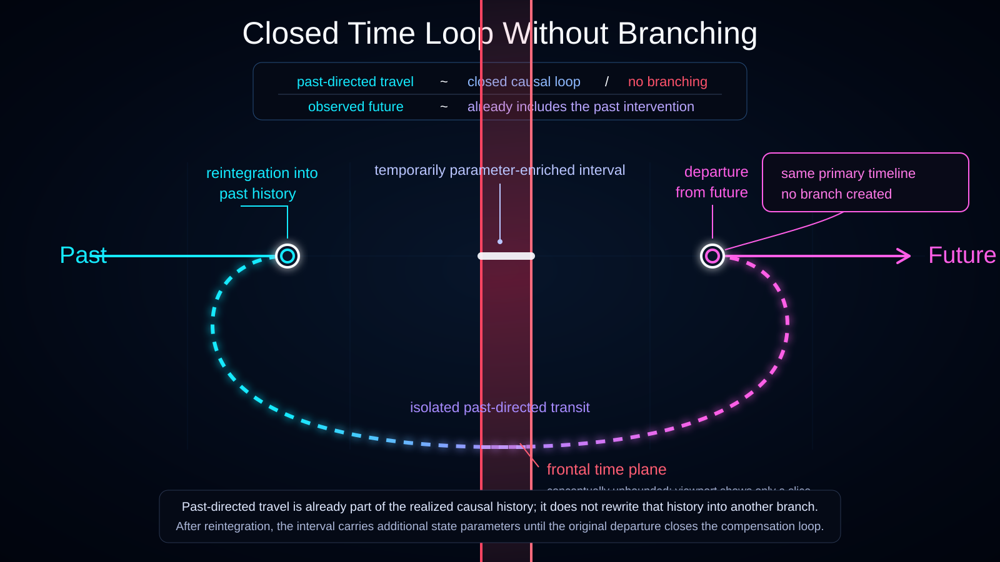

# Closed Time Loop and History-Class Split

Status: draft



This diagram visualizes the current Ontoverse **Closed Time Loop** model inside the compressed history bundle.

It distinguishes two separate ideas that should not be conflated:

- **history-class divergence at reintegration** — loop-compatible and loop-free continuations require different current states;
- **loop closure at departure** — the later departure enters isolated past-directed transit but does not create another branch at the departure node.

## Translations

- English

Localization will be added in a later localization pass.

## Diagram Mode

This is a **retrospective causal-structure view**.

The ruby plane is a selected reference frontal-time slice `S(F_ref)`, not the current maximal frontier `S(F_max)`.

```text
current-frontier diagram:
represented history bundle -> S(F_max)

this retrospective diagram:
already-described causal structure
------ S(F_ref) ------
continues on both sides of the selected slice
```

The current maximal frontier is intentionally not drawn.

## Shared History Class Before Reintegration

Before the first required difference created by the returned traveler, the loop-compatible and loop-free complete continuations may remain represented as one compressed History Equivalence Class.

```text
shared history class
-------------------R-------------------->
```

The visible shared strand therefore does not imply that only one complete future is possible. It represents several admissible continuations that still require the same current modeled state.

## Reintegration as the Minimal Divergence Case

At reintegration `R`, the loop-compatible state contains the returned traveler and the state carried through transit. The loop-free state does not.

That makes `R` the first required distinction in the minimal diagrammed case:

```text
shared history class
-------------------R-------------------->
                    |\
                    | \  loop-free strand
                    |
                    +---- loop-compatible strand ---- D
                          ^                             |
                          +------ past transit ---------+
```

`R` is therefore shown as both:

- the reintegration point of the time traveler;
- a normal History-Space **Divergence Node** between two now-distinguishable history classes.

If a more complete physical model required a difference before apparent reintegration, the real divergence would move to that earlier first distinction. The diagram shows the minimal case only.

## Loop-Compatible Strand

The lower/main loop-compatible strand contains the ordinary history whose earlier state already includes reintegration.

The interval from `R` to `D` is drawn thicker or brighter as the **parameter-enriched interval**.

This represents the current state-accounting intuition that the ordinary history description between reintegration and departure includes the returned traveler and its causal consequences.

## Loop-Free Strand

The second child strand represents an admissible continuation in which the returned traveler is absent at `R`.

It is not created by the later departure event. It is a separately represented child history because the state at `R` differs from the loop-compatible state.

The diagram does not require both child histories to be physically realized in any established interpretation. It only shows that the Ontoverse history-bundle model can represent both as distinct admissible history classes when both remain globally consistent.

## Departure Closes the Loop

The later departure `D` is not another divergence node.

```text
loop-compatible history
R -> ... -> D
          |
          +-> isolated transit -> R
```

The traveler leaving ordinary synchronization at `D` closes the already constrained loop.

The diagram therefore places the explicit callout **`departure closes loop — no branch at D`** at the departure node.

## Transit Isolation

The dashed oval-like path is the isolated past-directed transit.

It is not an ordinary forward historical strand and should not be read as another history-space branch.

The path leaves the loop-compatible history at `D`, crosses the selected reference frontal-time slice, and reconnects at `R`.

## Traveler State and Future-Derived Information

The reintegrated traveler may carry state acquired later along the same loop-compatible history:

- memories;
- records;
- physical modifications;
- carried objects;
- learned information.

Those properties are part of the state difference between loop-compatible and loop-free histories at `R`.

Conceptually:

```text
later traveler state
-> isolated past-directed transit
-> earlier traveler state at R
-> history-class distinction
-> consequences remain inside the same loop-compatible history
```

This provides the visual basis for branch-relative future-derived information or apparent foreknowledge without implying access to every possible future history.

## Parameter-Enriched Interval and Compensation

The loop-compatible strand is visually enriched from `R` to `D`.

At `D`, the pre-departure traveler instance enters isolated transit. The ordinary strand can therefore return to its baseline state-description width after departure.

The visual compensation is an intuition about state accounting, not a claim of annihilation, information destruction, or cancellation of a known conserved physical quantity.

## Reference Frontal-Time Slice

The ruby plane is conceptually unbounded. The finite rectangle is only the visible projected patch.

Both the loop-compatible historical strand and the isolated transit may cross `S(F_ref)` because this is a retrospective reference slice inside already-described history.

Crossing it does not mean that realized structure exists beyond the current `S(F_max)` frontier.

## Distant Reintegration

The displayed separation between `R` and `D` is illustrative.

Under the current history-bundle model, reintegration may lie much farther into the past. The loop-compatible history simply becomes separately represented wherever its first required state distinction occurs.

Any physical limit on past-directed travel remains an open problem.

## Conceptual Reading

```text
compressed shared history class
-> first required distinction at R
-> loop-free child history
   or
-> loop-compatible child history
-> parameter-enriched interval
-> departure D
-> isolated transit
-> same R
```

The diagram therefore does not show the future rewriting the past. It shows a globally consistent complete continuation requiring an earlier state distinction inside the history bundle.

## Documentation Role

Use this visualization when explaining:

- compressed History Equivalence Classes;
- divergence as first required state distinction;
- time-travel-induced class splitting at reintegration;
- why departure is not the branch-creation point;
- loop-compatible versus loop-free histories;
- transit isolation;
- the parameter-enriched interval and compensation;
- `S(F_ref)` versus `S(F_max)`;
- distant reintegration;
- history-relative future-derived information.
