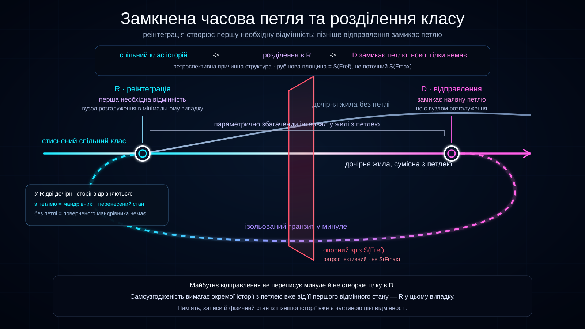

# Замкнена часова петля та розділення класу історій

Статус: чернетка



Ця діаграма візуалізує поточну модель **замкненої часової петлі** Ontoverse всередині стисненого пучка історій.

Вона розділяє дві ідеї, які не слід змішувати: **розгалуження класу історій під час реінтеграції**, коли продовження з петлею й без неї вже потребують різних станів, та **замикання петлі під час відправлення**, коли пізніше відправлення входить в ізольований транзит у минуле, але не створює нову гілку в `D`.

## Переклади

- [English](../../)
- Українська

## Режим діаграми

Це **ретроспективний вигляд причинної структури**. Рубінова площина є вибраним опорним зрізом `S(F_ref)`, а не поточним максимальним фронтом `S(F_max)`.

```text
діаграма поточного фронту:
представлений пучок історій -> S(F_max)

ця ретроспективна діаграма:
вже описана причинна структура
------ S(F_ref) ------
продовжується з обох боків вибраного зрізу
```

Поточний максимальний фронт навмисно не намальований.

## Спільний клас історій до реінтеграції

До першої необхідної відмінності, спричиненої поверненим мандрівником, повні продовження з петлею та без неї можуть залишатися одним стисненим класом еквівалентності.

```text
спільний клас історій
-------------------R-------------------->
```

Спільна жила не означає єдиного можливого майбутнього: вона може представляти кілька допустимих продовжень з однаковим поточним станом.

## Реінтеграція як мінімальний випадок розгалуження

У `R` стан із петлею містить поверненого мандрівника та перенесений через транзит стан, а стан без петлі — ні.

```text
спільний клас історій
-------------------R-------------------->
                    |\
                    | \  жила без петлі
                    |
                    +---- жила з петлею ------------ D
                          ^                            |
                          +------ транзит у минуле ----+
```

Тому `R` є водночас точкою реінтеграції та звичайним **вузлом розгалуження** між двома тепер розрізнюваними класами. Якщо повніша фізична модель вимагатиме відмінності ще раніше, справжнє розгалуження має зміститися туди.

## Жила, сумісна з петлею

Основна жила містить звичайну історію, раніший стан якої вже включає реінтеграцію. Інтервал від `R` до `D` намальований товстішим або яскравішим як **параметрично збагачений інтервал**, що відображає розширений опис стану з поверненим мандрівником і його наслідками.

## Жила без петлі

Друга дочірня жила представляє допустиме продовження без поверненого мандрівника в `R`. Її не створює пізніше відправлення; вона представлена окремо, бо стан у `R` уже інший.

Діаграма не стверджує, що обидва дочірні класи фізично реалізовані в межах якоїсь усталеної інтерпретації. Вона лише показує можливість їх окремого представлення, якщо обидва глобально самоузгоджені.

## Відправлення замикає петлю

`D` не є ще одним вузлом розгалуження.

```text
історія з петлею
R -> ... -> D
          |
          +-> ізольований транзит -> R
```

Вихід мандрівника зі звичайної синхронізації в `D` замикає вже узгоджену петлю. Тому діаграма підписує: **`відправлення замикає петлю — у D немає нової гілки`**.

## Ізоляція транзиту

Пунктирна овальна траєкторія — ізольований транзит у минуле. Це не звичайна історична жила й не ще одна гілка простору історій. Вона залишає жилу з петлею в `D`, перетинає опорний `S(F_ref)` і повертається в `R`.

## Стан мандрівника та інформація з майбутнього

Мандрівник може переносити спогади, записи, фізичні зміни, об’єкти та знання, набуті пізніше в тій самій історії.

```text
пізніший стан мандрівника
-> ізольований транзит у минуле
-> раніший стан мандрівника в R
-> відмінність класів історій
-> наслідки залишаються в тій самій історії з петлею
```

Це дає візуальну основу для інформації з майбутнього, відносної до конкретної історії, без доступу до всіх можливих майбутніх історій.

## Параметрично збагачений інтервал і компенсація

У `D` передвідправний екземпляр мандрівника входить в ізольований транзит, тому звичайна жила може повернутися до базової ширини після відправлення. Це інтуїція обліку стану, а не твердження про анігіляцію, знищення інформації або скасування відомої збережуваної величини.

## Опорний зріз фронтального часу

Рубінова площина концептуально необмежена; видимий прямокутник — лише її проєкція. І жила, і транзит можуть перетинати `S(F_ref)`, бо це ретроспективний опорний зріз, а не поточний `S(F_max)`.

## Далека реінтеграція

Відстань між `R` і `D` умовна. Реінтеграція може лежати значно далі в минулому; історія з петлею стає окремо представленою там, де виникає її перша необхідна відмінність. Фізичні межі такого перенесення залишаються відкритими.

## Концептуальне читання

```text
стиснений спільний клас історій
-> перша необхідна відмінність у R
-> дочірня історія без петлі
   або
-> дочірня історія з петлею
-> параметрично збагачений інтервал
-> відправлення D
-> ізольований транзит
-> те саме R
```

Діаграма не показує переписування минулого майбутнім. Вона показує глобально самоузгоджене повне продовження, яке потребує ранішої відмінності стану всередині пучка історій.

## Роль у документації

Використовуйте діаграму для пояснення класів еквівалентності, першої необхідної відмінності, розгалуження під час реінтеграції, відсутності нової гілки в `D`, історій із петлею та без неї, ізоляції транзиту, параметрично збагаченого інтервалу, `S(F_ref)` проти `S(F_max)`, далекої реінтеграції та інформації з майбутнього.
