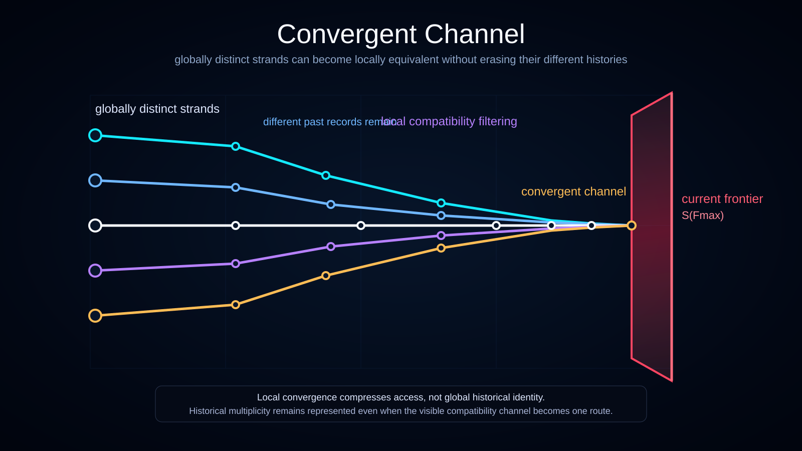

# Convergent Channel

Status: draft



This diagram explains how distinct historical origins may pass through divergence, compatibility filtering, and convergence before reaching the **current frontal-time frontier**.

## Translations

- English
- [Українська](./l10n/uk_UA/)

## What the Diagram Shows

The left side contains several **distinct historical origins**.

From these origins, trajectories diverge into multiple possible paths. Some paths remain separate, while others become compatible under the current description and enter a narrower **compatibility channel**.

Near the right side, the compatible trajectories form a **convergent channel**. This channel ends at the ruby frontal time plane representing the current maximal slice `S(F_max)`.

## Relation to Global Frontal-Time Slices

The ruby plane is one global cross-section of history-space, not a timestamp belonging only to the convergent channel.

The diagram uses the **current-frontier** mode:

```text
distinct histories
-> divergence and compatibility filtering
-> convergent channel
-> S(F_max)
```

Other mutually incompatible histories may also have branch-local states at the same global frontal-time value even when they are not drawn in this visualization.

## Convergence Does Not Erase the Past

A convergent channel is not a claim that distinct histories become globally identical.

The safer interpretation is:

```text
Different histories may remain globally distinct,
but their locally accessible future states may become equivalent.
```

The diagram therefore shows convergence as a shared channel of access, not as the destruction of historical information.

## No Future-Side Continuation

The convergent channel terminates at `S(F_max)`.

No realized nodes or trajectories are drawn beyond the plane because the diagram treats it as the current maximal frontal-time slice rather than a retrospective reference slice.

## Documentation Role

Use this visualization when explaining:

- global frontal-time slices;
- distinct historical origins;
- divergence;
- compatibility channels;
- convergent channels;
- observer access to locally compatible histories.
