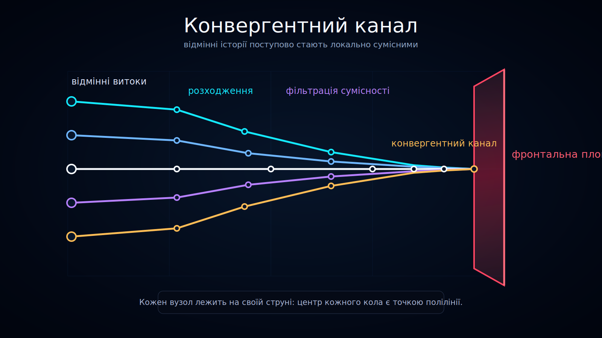

<!--
l10n:
  locale: uk_UA
  source_locale: default
  source_path: ../../README.md
  source_hash: sha256:92fd5169584206ff12b07fd792e27ab7e76e42c783cd94d34e88bbc4c96caeb0
  mode: translated
-->

# Конвергентний канал

Статус: draft



Ця діаграма пояснює, як відмінні історичні витоки можуть пройти через розходження, фільтрацію сумісності та збіжність, перш ніж досягти **площини фронтального часу**.

## Переклади

- [English](../../)
- Українська

## Що показує діаграма

Ліва частина містить кілька **відмінних історичних витоків**.

Від цих витоків траєкторії розходяться на кілька можливих шляхів. Деякі шляхи залишаються окремими, тоді як інші стають сумісними за поточним описом і входять до вужчого **каналу сумісності**.

Біля правого краю сумісні траєкторії утворюють **конвергентний канал**. Цей канал завершується на рубіновій площині фронтального часу.

## Збіжність не стирає минуле

Конвергентний канал не є твердженням, що відмінні історії стають глобально тотожними.

Безпечніше тлумачення:

```text
Різні історії можуть залишатися глобально відмінними,
але їхні локально доступні майбутні стани можуть стати еквівалентними.
```

Тому діаграма показує збіжність як спільний канал доступу, а не як знищення історичної інформації.

## Відсутність продовження з боку майбутнього

Конвергентний канал завершується на площині фронтального часу.

За площиною не намальовано реалізованих вузлів або траєкторій, бо діаграма трактує її як межу теперішнього зрізу моделі.

## Роль у документації

Використовуйте цю візуалізацію для пояснення:

- відмінних історичних витоків;
- розходження;
- каналів сумісності;
- конвергентних каналів;
- доступу спостерігача до локально сумісних історій.
