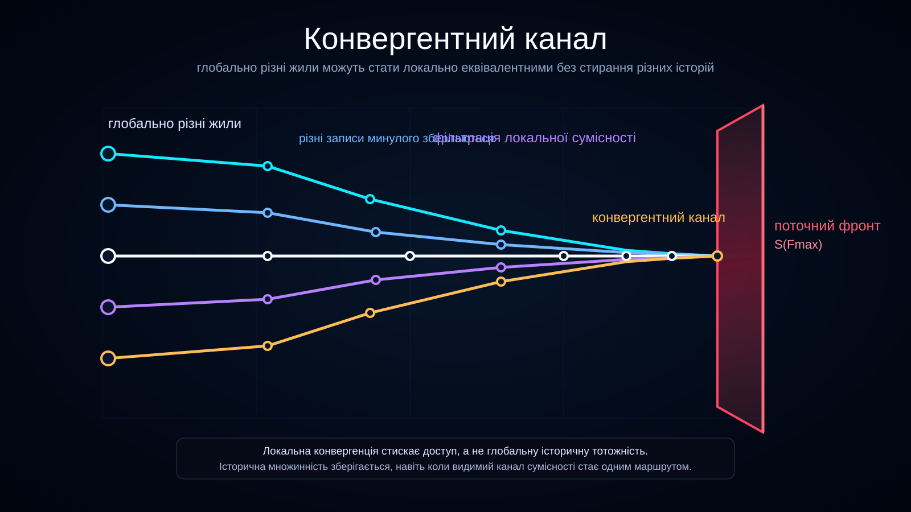

# Конвергентний канал

Статус: чернетка



Ця діаграма пояснює, як **глобально різні історичні жили** можуть стати локально еквівалентними для вибраного спостерігача, підсистеми або coarse-grained опису до досягнення поточного фронту фронтального часу.

## Переклади

- [English](../../)
- Українська

## Початкова точка

Діаграма починається **після того, як релевантні відмінності класів історій уже існують**. Кожна вхідна лінія є окремо представленою історичною жилою, а не повним майбутнім, яке мусило бути незалежним від усіх інших історій від самого початку.

Їхня раніша спільна або стиснена структура класів еквівалентності лежить поза межами діаграми.

## Фільтрація сумісності

```text
глобально різні історичні жили
-> локальна сумісність станів зростає
-> спільний канал сумісності
```

Фільтрація залежить від спостерігача або підсистеми й не означає, що повні фізичні історії стали глобально тотожними.

## Конвергентний канал

**Конвергентний канал** — спільна структура локального доступу, до якої входить більше ніж одна глобально відмінна історична жила.

```text
історична множинність залишається > 1
+
локально доступні стани стають еквівалентними
-> спільний конвергентний канал
```

Тому канал зберігає різницю між **глобальною історичною тотожністю** повної жили та **локальною еквівалентністю** того, що вибраний спостерігач зараз може розрізнити.

## Зв’язок із пучком історій

Пучок історій не розділяє явно історії, доки їхні поточні стани однакові. Конвергентний канал описує іншу ситуацію: історії вже глобально відмінні через різне минуле, але їхні **поточні локально доступні стани** можуть знову стати еквівалентними.

Тому поточна модель **не** вважає конвергенцію глобальним повторним об’єднанням дочірніх історій в один клас еквівалентності.

## Фронт фронтального часу

Рубінова площина — поточний максимальний зріз `S(F_max)`, глобальний поперечний зріз пучка історій.

```text
різні жили
-> локальна сумісність
-> конвергентний канал
-> S(F_max)
```

Реалізовані жили й канал завершуються на площині.

## Історична множинність

Візуалізація має зберігати ознаку того, що представлено кілька глобальних історичних жил, навіть коли локальний канал намальовано як один маршрут. Це не дозволяє сплутати візуальне стиснення зі стиранням історичної інформації.

## Роль у документації

Використовуйте діаграму для пояснення глобально відмінних історичних жил, локальної еквівалентності проти глобальної тотожності, фільтрації сумісності, конвергентних каналів, історичної множинності, доступу спостерігача та поточного фронту `S(F_max)`.
