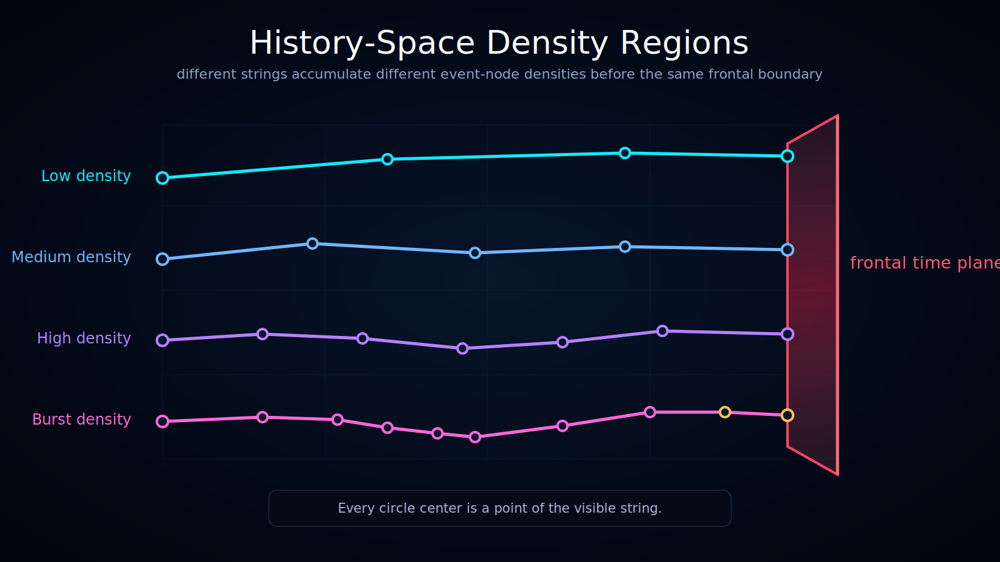

# History-Space Density Regions

Status: draft

This diagram shows how **temporal density** may vary across different regions of history-space.

## Translations

- English
- [Українська](./l10n/uk_UA/)

## What the Diagram Shows

The diagram separates history-space into three conceptual density regions:

- **low temporal density region** — sparse trajectories and fewer event-nodes;
- **medium temporal density region** — a moderate number of event-nodes and branch opportunities;
- **high temporal density region** — dense event-node populations and many closely spaced transitions.

All visible trajectories terminate at the ruby frontal time plane.

## Interpretation

Ontoverse treats temporal density as a local property of a trajectory or region, not as a uniform value across the entire history-space.

The same frontal-time boundary can intersect regions with very different numbers of significant event-nodes.

This visualizes the idea that local time may be unevenly accumulated across different histories or regions of the model.

## Important Constraint

No event-nodes are shown beyond the frontal time plane.

The plane represents the present boundary in this visualization. Content beyond it would represent a future-side structure that the current model page does not yet define.

## Documentation Role

Use this visualization when explaining:

- non-uniform temporal density;
- regions of different event-node density;
- the difference between frontal time and locally accumulated time;
- history-space as a structured field rather than a single branch.
