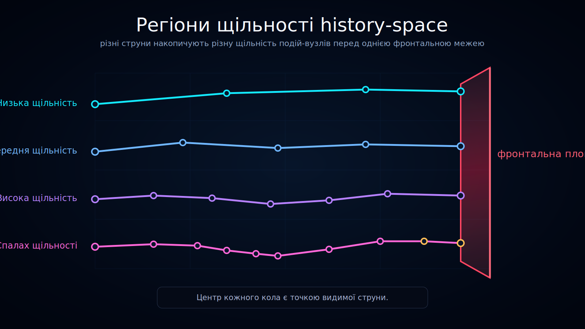

<!--
l10n:
  locale: uk_UA
  source_locale: default
  source_path: ../../README.md
  source_hash: sha256:ec99dacf6c66a30d09a0bf0388a3bdcccd0e3f65a099867541bccb8327052c85
  mode: translated
-->

# Регіони щільності history-space

Статус: draft

Ця діаграма показує, як **темпоральна щільність** може відрізнятися між різними регіонами history-space.

## Переклади

- [English](../../)
- Українська

## Що показує діаграма

Діаграма розділяє history-space на три концептуальні регіони щільності:

- **регіон низької темпоральної щільності** — розріджені траєкторії та менше вузлів подій;
- **регіон середньої темпоральної щільності** — помірна кількість вузлів подій і можливостей розгалуження;
- **регіон високої темпоральної щільності** — щільні популяції вузлів подій і багато близько розташованих переходів.

Усі видимі траєкторії завершуються на рубіновій площині фронтального часу.

## Інтерпретація

Ontoverse розглядає темпоральну щільність як локальну властивість траєкторії або регіону, а не як рівномірне значення для всього history-space.

Одна й та сама межа фронтального часу може перетинати регіони з дуже різною кількістю значущих вузлів подій.

Це візуалізує ідею, що локальний час може накопичуватися нерівномірно в різних історіях або регіонах моделі.

## Важливе обмеження

За площиною фронтального часу не показано жодних вузлів подій.

Площина представляє межу теперішнього в цій візуалізації. Вміст за нею означав би структуру з боку майбутнього, яку сторінка моделі ще не визначає.

## Роль у документації

Використовуйте цю візуалізацію для пояснення:

- нерівномірної темпоральної щільності;
- регіонів із різною щільністю вузлів подій;
- різниці між фронтальним часом і локально накопиченим часом;
- history-space як структурованого поля, а не однієї гілки.
