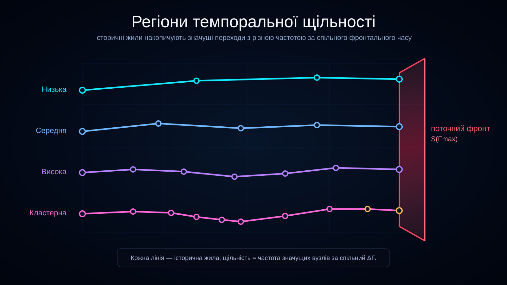

# Регіони темпоральної щільності у просторі історій

Статус: чернетка



Ця діаграма показує, як **темпоральна щільність** може відрізнятися між історичними жилами та регіонами пучка історій Ontoverse.

## Переклади

- [English](../../)
- Українська

## Що показує діаграма

Порівнюються характерні жили з різною частотою значущих переходів:

- **низька темпоральна щільність** — рідкі значущі вузли подій;
- **середня темпоральна щільність** — помірна частота вузлів;
- **висока темпоральна щільність** — часті вузли з малими проміжками;
- **кластерна щільність** — локальне згущення значущих переходів.

Усі видимі жили завершуються на рубіновому поточному фронті `S(F_max)`.

## Інтерпретація через пучок історій

Одне значення фронтального часу відповідає глобальному зрізу пучка `S(F)`. Той самий зріз може перетинати багато поточно розрізнюваних жил, що накопичили різну кількість значущих вузлів.

```text
однаковий глобальний ΔF
-> розріджена жила: менше значущих переходів
-> щільна жила: більше значущих переходів
```

Жила не мусить мати значущий вузол на кожному вибраному зрізі. Якщо кілька допустимих історій залишаються еквівалентними за станом, вони можуть представлятися однією жилою й мати один опис щільності до необхідного розділення класу.

## Інтерпретація

Ontoverse трактує темпоральну щільність як локальну властивість жили або регіону, а не як однорідну властивість усього пучка. Одна глобальна прогресія фронтального часу може співіснувати з різною кількістю накопиченого локального часу.

Темпоральна щільність відрізняється від щільності причинної обробки: ця діаграма кодує **частоту значущих вузлів подій**, а не спекулятивне навантаження обробки.

## Поточний фронт

За площиною фронтального часу немає вузлів подій, бо вона представляє `S(F_max)`.

## Роль у документації

Використовуйте діаграму для пояснення пучка історій, глобальних зрізів фронтального часу, неоднорідної темпоральної щільності, різної частоти значущих переходів і різниці між фронтальним та локально накопиченим часом.
