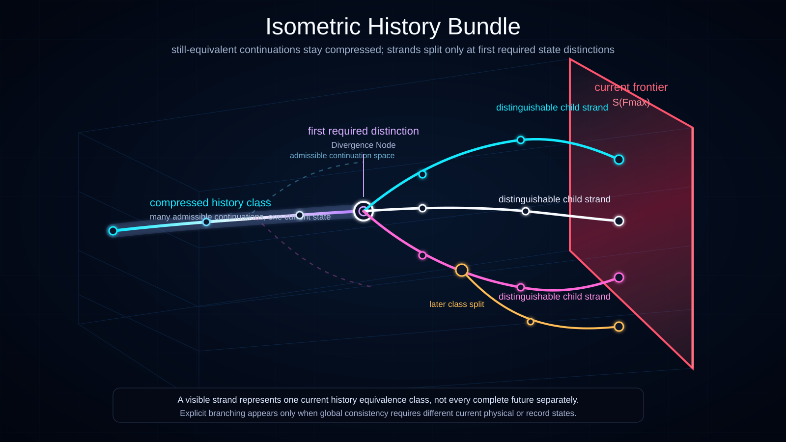

# Isometric History Bundle

Status: draft



This visualization presents the current Ontoverse **history bundle** as a volumetric structure rather than as a flat list of fully expanded timelines.

The diagram uses an isometric projection to show shared/compressed historical strands that split only when a different current state description becomes necessary, then continue toward the ruby **current frontal-time frontier** `S(F_max)`.

## Translations

- English
- [Українська](./l10n/uk_UA/)

## Conceptual Reading

- **History-space volume** — the shown box represents a local conceptual region of admissible historical structure.
- **History bundle** — the set of currently distinguishable historical strands shown inside that region.
- **Shared/compressed strand** — one visible line may represent a History Equivalence Class containing several admissible complete continuations that still require the same current modeled state.
- **Divergence node** — a highlighted split marks the first significant point where one represented class must separate into incompatible state descriptions.
- **Child strands** — after divergence, separately drawn lines represent now-distinguishable history classes.
- **Event-nodes** — circles mark significant transitions; a strand does not need a significant node at every sampled frontal-time slice.
- **Current frontal-time frontier** — the ruby plane on the right represents `S(F_max)` and intersects the current states of all shown strands.

## Compression Before Divergence

The visualization should not be read as if every possible child timeline had to exist as a separate line from the left edge of the diagram.

Instead:

```text
shared represented strand
= one current history equivalence class
= potentially many still-equivalent complete continuations
```

Only when a distinction is required does the diagram expand the class:

```text
shared class
------ divergence / first required distinction ------>
       /                                      \
  child strand A                         child strand B
```

This is a conceptual representation of minimal distinguishability, not a claim that reality literally performs data compression.

## Relation to Frontal-Time Slices

The ruby plane is a global cross-section of the whole shown bundle, not a timestamp belonging to one strand.

Conceptually:

```text
strand A  --------------------|->
strand B  --------------------|->
strand C  --------------------|->
                           S(F)
```

The shown plane is specifically `S(F_max)`, so realized strands terminate at it in this visualization.

Earlier frontal-time slices are not drawn individually. The bundle can be understood as passing through a progression:

```text
S(F0) -> S(F1) -> ... -> S(F_max)
```

## Divergence Is a State Distinction

A visible split should be interpreted as the earliest significant location where the child histories require different current physical, record, or causal states.

It should **not** be interpreted as an assertion that every future universe is literally created at that point.

Admissible downstream continuations may have existed conceptually before the split while remaining compressed inside one represented class.

## Temporal Density

Different child strands may accumulate significant event-nodes at different frequencies after divergence while sharing the same global frontal-time ordering.

This allows the same isometric bundle to contain sparse, dense, clustered, and mixed temporal-density regions without requiring different frontal-time speeds.

## Compatibility and Convergence

Globally distinct strands may later become locally equivalent under a selected observer or subsystem description.

If shown, such convergence should be read as a compatibility channel, not as deletion of the prior history-class distinction.

## Why Isometric Projection

The isometric view makes several current Ontoverse ideas easier to see simultaneously:

- history-space is not intended as one flat line;
- one represented strand may compress several still-equivalent continuations;
- explicit branching occurs only when state distinction becomes necessary;
- child histories can spread in more than one conceptual dimension;
- different strands can have different temporal densities;
- one frontal-time slice can cross the entire bundle at once.

## Documentation Role

Use this visualization when explaining:

- the history bundle;
- History Equivalence Classes;
- Historical Strands;
- the Minimal Distinguishability Principle;
- divergence as first required state distinction;
- global frontal-time slices;
- non-uniform temporal density across the bundle.
