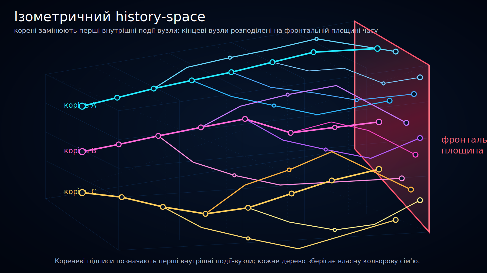

<!--
l10n:
  locale: uk_UA
  source_locale: default
  source_path: ../../README.md
  source_hash: sha256:880d0f837f9b747d19691a53af153ad7a47306e96cf04b451951d5f41f72eff5
  mode: translated
-->

# Ізометричний history-space

Статус: draft

Ця візуалізація представляє history-space як об’ємну структуру, а не як плоску часову шкалу.

Діаграма використовує ізометричну проєкцію, щоб показати кілька деревоподібних реалізованих струн, які проходять крізь той самий об’єм history-space до рубінової **площини фронтального часу**.

## Переклади

- [English](../../)
- Українська

## Концептуальне читання

- **Об’єм history-space**: показаний паралелепіпед представляє локальний концептуальний зріз можливої або реалізованої історичної структури.
- **Деревоподібні струни**: кольорові струни представляють реалізовані історичні гілки, які можуть розщеплюватися на дочірні гілки.
- **Вузли подій**: кола позначають значущі вузли подій. У цьому SVG центр кожного вузла також є точкою його видимої струни.
- **Площина фронтального часу**: рубінова площина праворуч представляє межу показаного зрізу моделі.
- **Без реалізованого продовження з боку майбутнього**: реалізовані гілки завершуються на площині фронтального часу або перед нею.

## Навіщо ізометрична проєкція

Попередні плоскі діаграми корисні для порівняння патернів щільності, але недостатньо чітко показують, що history-space Ontoverse задуманий як об’ємна концептуальна структура.

Ізометричний вигляд полегшує розуміння таких ідей:

- гілки можуть розходитися більш ніж в одному візуальному вимірі;
- різні регіони можуть мати різну щільність вузлів подій;
- кілька деревоподібних структур можуть наближатися до однієї площини фронтального часу;
- сумісність із фронтальною межею не вимагає візуального сплющення всіх історій в одну лінію.
