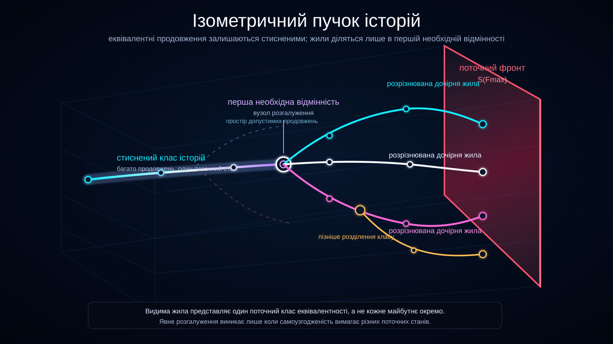

# Ізометричний пучок історій

Статус: чернетка



Ця візуалізація показує поточний **пучок історій** Ontoverse як об’ємну структуру, а не плаский список повністю розгорнутих часових ліній. Ізометрична проєкція показує спільні/стиснені історичні жили, що розділяються лише тоді, коли стає необхідним інший поточний опис стану, а потім продовжуються до рубінового поточного фронту `S(F_max)`.

## Переклади

- [English](../../)
- Українська

## Як читати діаграму

- **Об’єм простору історій** — локальний концептуальний регіон допустимої історичної структури.
- **Пучок історій** — множина поточно розрізнюваних історичних жил у цьому регіоні.
- **Спільна/стиснена жила** — одна видима лінія може представляти клас еквівалентності з кількома допустимими повними продовженнями, яким ще потрібен однаковий поточний стан.
- **Вузол розгалуження** — перша значуща точка, де один клас уже потребує несумісних описів стану.
- **Дочірні жили** — окремі лінії після розгалуження представляють тепер розрізнювані класи.
- **Вузли подій** — значущі переходи; жила не мусить мати вузол на кожному зрізі.
- **Поточний фронт** — рубінова площина `S(F_max)` перетинає поточні стани всіх показаних жил.

## Стиснення до розгалуження

```text
спільна представлена жила
= один поточний клас еквівалентності історій
= потенційно багато ще еквівалентних повних продовжень
```

Лише коли відмінність стає необхідною, клас розгортається:

```text
спільний клас
------ розгалуження / перша необхідна відмінність ------>
       /                                         \
  дочірня жила A                            дочірня жила B
```

Це концептуальне представлення мінімальної розрізнюваності, а не твердження, що реальність буквально стискає дані.

## Зв’язок зі зрізами фронтального часу

Рубінова площина — глобальний поперечний зріз усього пучка, а не часова мітка однієї жили.

```text
жила A  --------------------|->
жила B  --------------------|->
жила C  --------------------|->
                         S(F)
```

Показана площина — саме `S(F_max)`, тому реалізовані жили завершуються на ній. Раніші зрізи можна уявляти як прогресію `S(F0) -> S(F1) -> ... -> S(F_max)`.

## Розгалуження — це відмінність стану

Видиме розділення означає найранішу значущу точку, де дочірні історії вже потребують різних поточних фізичних, інформаційних або причинних станів. Воно **не** означає буквального створення всіх майбутніх всесвітів у цю мить.

## Темпоральна щільність

Різні дочірні жили можуть накопичувати значущі вузли подій із різною частотою після розгалуження, зберігаючи спільне глобальне впорядкування фронтального часу.

## Сумісність і конвергенція

Глобально різні жили пізніше можуть стати локально еквівалентними для вибраного спостерігача або підсистеми. Таку конвергенцію слід читати як канал сумісності, а не як видалення попередньої відмінності історій.

## Чому ізометрична проєкція

Вона дозволяє одночасно побачити, що простір історій не є однією пласкою лінією, що одна жила може стискати кілька продовжень, що розгалуження виникає лише за необхідності відмінності стану, а різні жили можуть мати різну темпоральну щільність при спільному глобальному зрізі.

## Роль у документації

Використовуйте діаграму для пояснення пучка історій, класів еквівалентності, історичних жил, принципу мінімальної розрізнюваності, першої необхідної відмінності, зрізів фронтального часу та неоднорідної темпоральної щільності.
