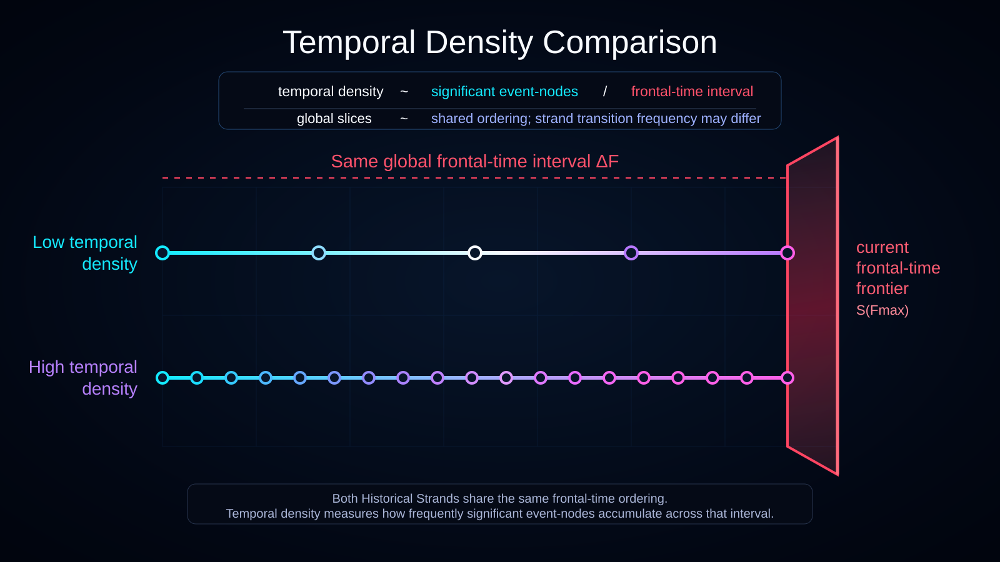

# Temporal Density Comparison

Status: draft



This diagram explains **temporal density** by comparing two Historical Strands across the same frontal-time interval.

## Translations

- English
- [Українська](./l10n/uk_UA/)

## What the Diagram Shows

Both strands are compared over the same interval of global frontal-time ordering and terminate at the same current frontier `S(F_max)`.

The upper strand has **low temporal density**:

- fewer significant event-nodes over the shared interval;
- longer gaps between significant transitions;
- less local-time accumulation under the current Ontoverse hypothesis.

The lower strand has **high temporal density**:

- more significant event-nodes over the same interval;
- shorter gaps between significant transitions;
- more local-time accumulation under the current hypothesis.

## History-Bundle Interpretation

A frontal-time value is a global history-bundle slice `S(F)`.

The diagram therefore samples the same global progression for two currently distinguishable historical strands:

```text
sampled slices:       F0  F1  F2  F3  F4  F5
low-density strand:   *   .   .   *   .   *
high-density strand:  *   *   *   *   *   *
```

The sampled representation does not imply that frontal time is fundamentally discrete.

If two admissible complete histories are still members of one History Equivalence Class, they may share one represented temporal-density description until a divergence requires separate strands.

## Interpretation

Local time is associated with the accumulation of significant strand-local transitions as frontal time progresses globally.

```text
temporal density ~ significant event-nodes / frontal-time interval
```

This is a conceptual definition, not a physical equation.

Temporal density is distinct from **Causal Processing Density**, which is a separate speculative concept for local state-coordination or processing load.

## Current Frontier

The strands stop at the right ruby plane because it represents the current maximal frontal-time slice `S(F_max)`.

Realized strand content beyond that plane would imply later actualized structure outside the shown model state.

## Documentation Role

Use this visualization when explaining:

- global frontal-time slices;
- Historical Strands;
- local time;
- temporal density;
- strand-specific significant-transition frequency;
- different local-time accumulation across the same global `ΔF`.
