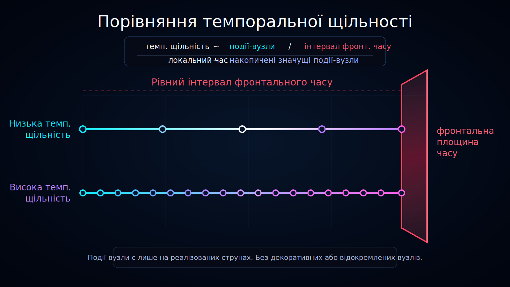

<!--
l10n:
  locale: uk_UA
  source_locale: default
  source_path: ../../README.md
  source_hash: sha256:ad439631b3cbd8813acc0eda6a9244d3845cb0f6c012a722dd83078b7e6fc906
  mode: translated
-->

# Порівняння темпоральної щільності

Статус: draft



Ця діаграма пояснює концепцію **темпоральної щільності** в Ontoverse, порівнюючи дві історичні траєкторії в межах одного **інтервалу фронтального часу**.

## Переклади

- [English](../../)
- Українська

## Що показує діаграма

Обидві траєкторії обмежені тими самими двома рубіновими площинами фронтального часу. Це означає, що їх оцінюють у межах одного інтервалу фронтального часу.

Верхня траєкторія має **низьку темпоральну щільність**:

- менше вузлів подій;
- довші проміжки між значущими переходами;
- менше локальних можливостей розгалуження.

Нижня траєкторія має **високу темпоральну щільність**:

- більше вузлів подій;
- коротші проміжки між значущими переходами;
- більше локальних можливостей розгалуження.

## Інтерпретація

В Ontoverse локальний час не розглядається лише як зовнішня координата. Він пов’язаний із накопиченням значущих вузлів подій уздовж траєкторії.

Концептуальний вираз:

```text
темпоральна щільність ~ вузли подій / інтервал фронтального часу
```

Це ще не фізичне рівняння. Це візуальне й концептуальне визначення, яке потребує майбутньої формалізації.

## Без вмісту з боку майбутнього

Траєкторії зупиняються на правій площині фронтального часу.

Це навмисно: площина представляє межу теперішнього в показаному зрізі моделі. Вузли та реалізовані шляхи за нею означали б майбутні події, яких ще немає в показаному зрізі.

## Роль у документації

Використовуйте цю візуалізацію для пояснення:

- фронтального часу;
- локального часу;
- темпоральної щільності;
- накопичення вузлів подій;
- того, чому різні історії можуть мати різну кількість змін у межах одного інтервалу фронтального часу.
