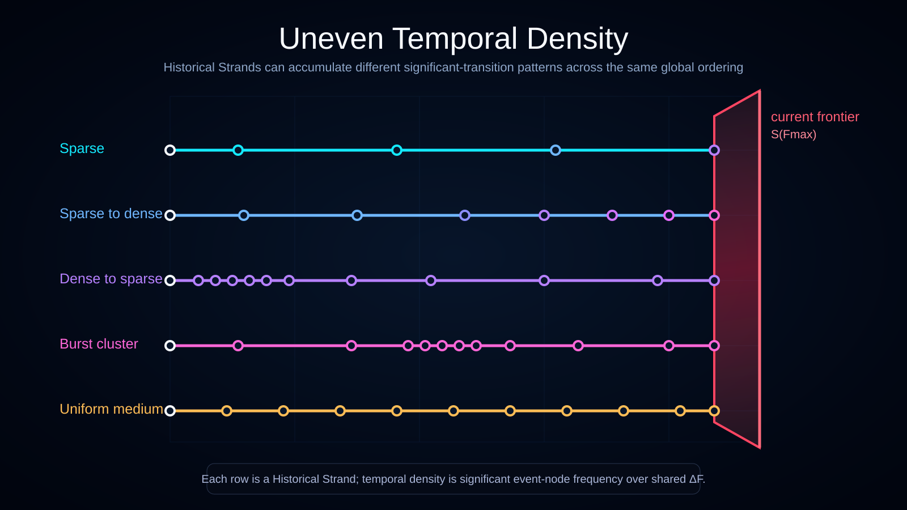

# Uneven Temporal Density Across History-Space

Status: draft



This diagram compares representative temporal-density patterns across Historical Strands in the Ontoverse history bundle.

## Translations

- English
- [Українська](./l10n/uk_UA/)

## What the Diagram Shows

Each row represents a different significant event-node frequency pattern before the same ruby current frontal-time frontier `S(F_max)`.

Patterns shown:

- **Sparse** — only a few significant event-nodes across the interval.
- **Sparse to dense** — significant event-nodes become more frequent as frontal time progresses.
- **Dense to sparse** — significant event-nodes are initially frequent and later become more widely spaced.
- **Burst cluster** — significant event-nodes are concentrated in a local interval.
- **Uniform medium** — significant event-nodes occur at a relatively even medium frequency.

## History-Bundle Interpretation

The rows are different currently distinguishable Historical Strands sampled across the same global frontal-time progression.

```text
shared progression: S(F0) -> S(F1) -> ... -> S(F_max)
strand A:           fewer significant transitions
strand B:           more significant transitions
strand C:           transitions concentrated in a burst
```

The visual spacing is a conceptual encoding of temporal density, not proof that frontal time is discrete.

A represented strand may still stand for several admissible complete histories while they remain members of the same History Equivalence Class. Separate density paths are only needed once their current states or transition descriptions become distinguishable.

## Interpretation

Different historical strands can accumulate different amounts of local time while sharing the same global frontal-time progression.

Temporal density here means significant event-node frequency per frontal-time interval. It is distinct from Causal Processing Density.

## Current Frontier

Every represented strand ends at the frontal-time plane because the plane is `S(F_max)` in this visualization.

The diagram intentionally avoids showing realized strand content beyond the current maximal slice.

## Documentation Role

Use this visualization when explaining:

- the history bundle;
- global frontal-time slices;
- uneven temporal density;
- local-time accumulation;
- sparse, dense, clustered, and changing significant-transition patterns.
