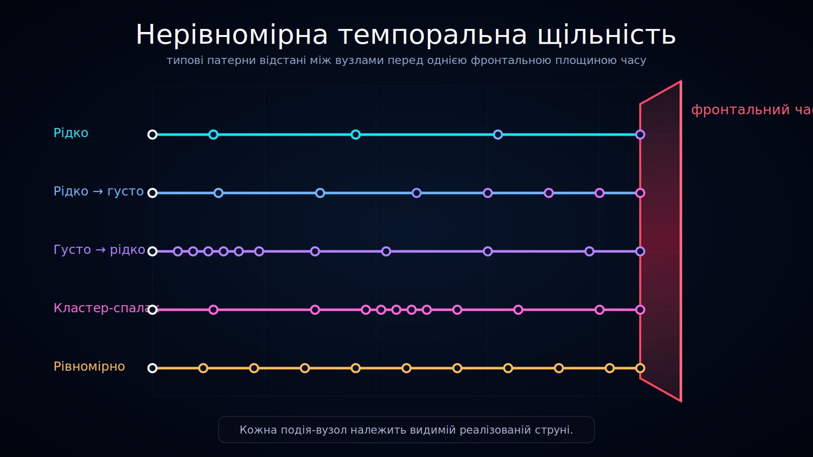

<!--
l10n:
  locale: uk_UA
  source_locale: default
  source_path: ../../README.md
  source_hash: sha256:c3d2ea851a854c5183a47ca6435f4023e82c9952c5b7132aa3bed518e2466ce5
  mode: translated
-->

# Нерівномірна темпоральна щільність у history-space

Статус: draft

Ця діаграма порівнює кілька типових патернів темпоральної щільності всередині history-space Ontoverse.

## Переклади

- [English](../../)
- Українська

## Що показує діаграма

Кожен рядок представляє інший патерн щільності вузлів подій перед тією самою рубіновою площиною фронтального часу.

Показані патерни:

- **Розріджений** — лише кілька вузлів подій у межах інтервалу.
- **Від розрідженого до щільного** — вузли подій частішають у міру наближення траєкторії до площини фронтального часу.
- **Від щільного до розрідженого** — вузли подій спочатку щільні, а потім розташовуються ширше.
- **Сплесковий кластер** — вузли подій зосереджені в локальному кластері.
- **Рівномірний середній** — вузли подій розподілені відносно рівномірно із середньою щільністю.

## Інтерпретація

Мета цієї діаграми — показати, що темпоральна щільність не обов’язково має бути рівномірною в history-space.

Різні траєкторії можуть накопичувати різну кількість локального часу, навіть коли їх порівнюють із тією самою межею фронтального часу.

## Без вмісту з боку майбутнього

Кожна траєкторія завершується на площині фронтального часу.

Діаграма навмисно не показує реалізовані гілки або вузли подій за площиною, бо бік майбутнього не є частиною показаного зрізу моделі.

## Роль у документації

Використовуйте цю візуалізацію для пояснення:

- нерівномірної темпоральної щільності;
- накопичення локального часу;
- розріджених, щільних і кластеризованих патернів вузлів подій;
- чому history-space слід розглядати як нерівномірний, а не як рівну сітку.
