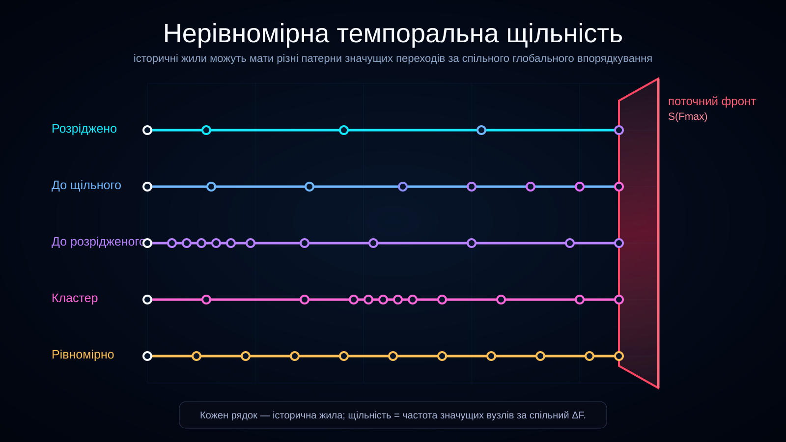

# Нерівномірна темпоральна щільність у просторі історій

Статус: чернетка



Ця діаграма порівнює характерні патерни темпоральної щільності в різних історичних жилах пучка Ontoverse.

## Переклади

- [English](../../)
- Українська

## Що показує діаграма

Кожен рядок представляє інший патерн частоти значущих вузлів подій перед тим самим рубіновим поточним фронтом `S(F_max)`:

- **розріджений** — лише кілька значущих вузлів за інтервал;
- **від розрідженого до щільного** — вузли частішають із просуванням фронтального часу;
- **від щільного до розрідженого** — спочатку вузли часті, згодом проміжки зростають;
- **кластерний сплеск** — вузли сконцентровані в локальному інтервалі;
- **рівномірний середній** — відносно рівномірна середня частота.

## Інтерпретація через пучок історій

Рядки — різні поточно розрізнювані історичні жили, вибрані за тією самою глобальною прогресією:

```text
спільна прогресія: S(F0) -> S(F1) -> ... -> S(F_max)
жила A:            менше значущих переходів
жила B:            більше значущих переходів
жила C:            переходи зосереджені в сплеску
```

Візуальна відстань є концептуальним кодуванням темпоральної щільності, а не доказом дискретності фронтального часу.

Представлена жила може все ще відповідати кільком допустимим повним історіям, доки вони належать одному класу еквівалентності. Окремі патерни потрібні лише коли стани або описи переходів стають розрізнюваними.

## Інтерпретація

Різні жили можуть накопичувати різну кількість локального часу за спільної глобальної прогресії фронтального часу. Темпоральна щільність означає частоту значущих вузлів за інтервал фронтального часу й відрізняється від щільності причинної обробки.

## Поточний фронт

Кожна представлена жила закінчується на площині `S(F_max)`. Діаграма навмисно не показує реалізований вміст за поточним максимальним зрізом.

## Роль у документації

Використовуйте діаграму для пояснення пучка історій, глобальних зрізів фронтального часу, нерівномірної темпоральної щільності, локального часу й розріджених, щільних, кластерних та змінних патернів переходів.
