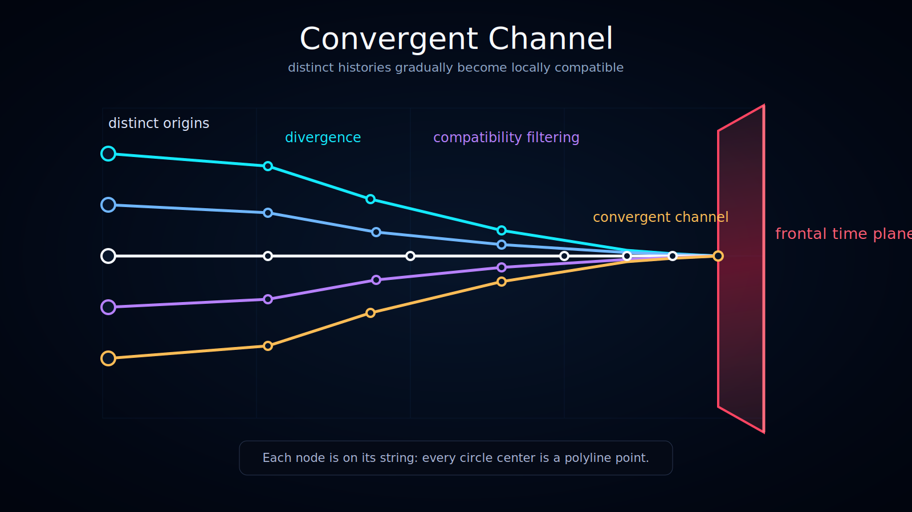

# Convergent Channel

Status: draft



This diagram explains how distinct historical origins may pass through divergence, compatibility filtering, and convergence before reaching the **frontal time plane**.

## Translations

- English — current
- [Українська](./l10n/uk_UA/)

## What the Diagram Shows

The left side contains several **distinct historical origins**.

From these origins, trajectories diverge into multiple possible paths. Some paths remain separate, while others become compatible under the current description and enter a narrower **compatibility channel**.

Near the right side, the compatible trajectories form a **convergent channel**. This channel ends at the ruby frontal time plane.

## Convergence Does Not Erase the Past

A convergent channel is not a claim that distinct histories become globally identical.

The safer interpretation is:

```text
Different histories may remain globally distinct,
but their locally accessible future states may become equivalent.
```

The diagram therefore shows convergence as a shared channel of access, not as the destruction of historical information.

## No Future-Side Continuation

The convergent channel terminates at the frontal time plane.

No realized nodes or trajectories are drawn beyond the plane because the diagram treats the plane as the present boundary of the model slice.

## Documentation Role

Use this visualization when explaining:

- distinct historical origins;
- divergence;
- compatibility channels;
- convergent channels;
- observer access to locally compatible histories.
