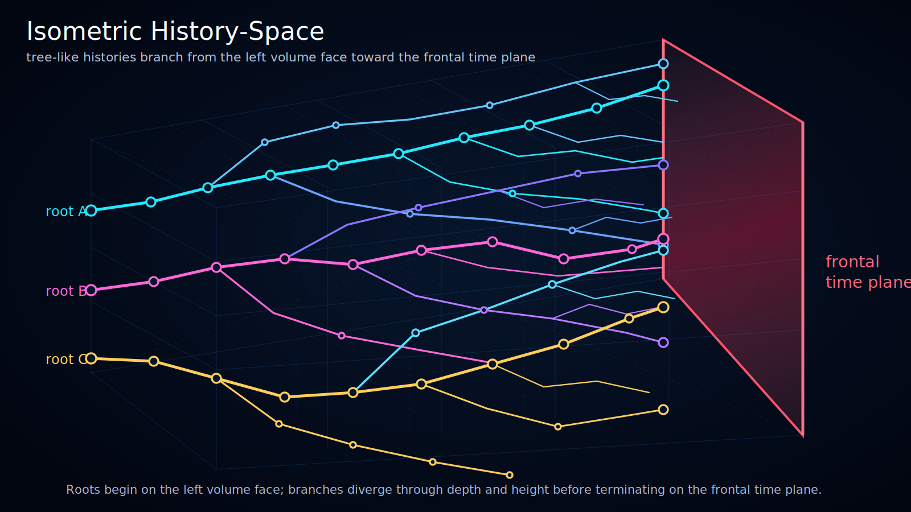

# Isometric History-Space

Status: draft

This visualization presents history-space as a volumetric structure rather than a flat timeline.

The diagram uses an isometric projection to show several tree-like realized strings moving through the same history-space volume toward the ruby **frontal time plane**.

## Conceptual Reading

- **History-space volume**: the shown box represents a local conceptual slice of possible or realized historical structure.
- **Tree-like strings**: colored strings represent realized historical branches that can split into child branches.
- **Event-nodes**: circles mark significant event-nodes. In this SVG, every node center is also a point of its visible string.
- **Frontal time plane**: the ruby plane on the right represents the current boundary of the shown model slice.
- **No realized future-side continuation**: realized branches terminate at or before the frontal time plane.

## Why Isometric Projection

Earlier flat diagrams are useful for comparing density patterns, but they do not clearly show that Ontoverse history-space is intended as a volumetric conceptual structure.

The isometric view makes the following ideas easier to see:

- branches can separate in more than one visual dimension;
- different regions can have different event-node density;
- multiple tree-like structures can approach the same frontal time plane;
- compatibility with the frontal boundary does not require all histories to be visually flattened into one line.
