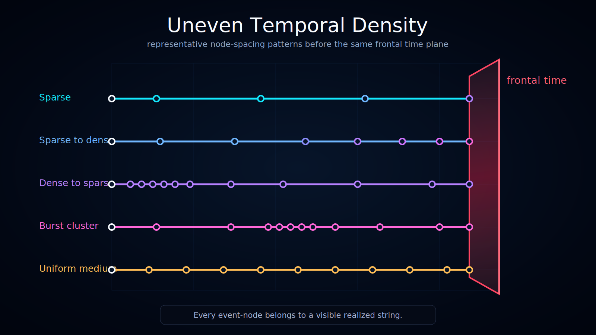

# Uneven Temporal Density Across History-Space

Status: draft

This diagram compares several representative temporal-density patterns inside Ontoverse history-space.

## What the Diagram Shows

Each row represents a different event-node density pattern before the same ruby frontal time plane.

Patterns shown:

- **Sparse** — only a few event-nodes across the interval.
- **Sparse to dense** — event-nodes become more frequent as the trajectory approaches the frontal time plane.
- **Dense to sparse** — event-nodes are initially dense and later become more widely spaced.
- **Burst cluster** — event-nodes are concentrated in a local cluster.
- **Uniform medium** — event-nodes are distributed at a relatively even medium density.

## Interpretation

The purpose of this diagram is to show that temporal density does not have to be uniform across history-space.

Different trajectories can accumulate different amounts of local time even when they are compared against the same frontal-time boundary.

## No Future-Side Content

Every trajectory ends at the frontal time plane.

The diagram intentionally avoids showing realized branches or event-nodes beyond the plane because the future side is not part of the current model slice.

## Documentation Role

Use this visualization when explaining:

- uneven temporal density;
- local time accumulation;
- sparse, dense, and clustered event-node patterns;
- why history-space should be treated as non-uniform rather than evenly gridded.
